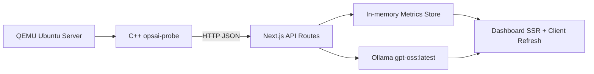

# Linux服务器智能运维助手

本项目是 Linux 结课大作业，主题为“Linux服务器智能运维助手”。系统由三部分组成：

1. `probe/`：C++ Linux 系统探针，采集 CPU、内存、磁盘和日志摘要。
2. `web/`：Next.js 前后端一体应用，使用 App Router、SSR 页面和 API Routes，不单独拆后端。
3. `documents/`：四名成员各自侧重点的论文 Markdown 文字稿。

## 架构



## 本地运行 Web

```bash
cd web
pnpm install
pnpm dev
```

访问 `http://127.0.0.1:3000`。如果还没有 probe 上报，页面会显示一条演示数据，便于先检查界面。

Ollama 默认配置：

```bash
export OLLAMA_URL=http://127.0.0.1:11434
export OLLAMA_MODEL=gpt-oss:latest
```

## 在 Ubuntu 虚拟机运行探针

```bash
cd probe
sudo apt update
sudo apt install -y build-essential cmake
cmake -S . -B build
cmake --build build
sudo cmake --install build
sudo sed -i 's#127.0.0.1:3000#<Mac或宿主机IP>:3000#' /etc/opsai/probe.conf
sudo opsai-probe /etc/opsai/probe.conf
```

如果 Dashboard 的资源趋势为空，通常说明只有一条演示数据，或者虚拟机探针没有持续上报。确认三件事：

1. Web 正在运行，当前页面地址是 `http://localhost:3001` 时，探针配置应指向 `http://<宿主机IP>:3001/api/metrics`。
2. 虚拟机能访问宿主机端口，例如 `curl http://<宿主机IP>:3001/api/metrics`。
3. 探针进程持续运行，例如 `sudo opsai-probe /etc/opsai/probe.conf` 或 systemd 服务运行中。

压力测试必须在 Linux 虚拟机中运行，这样 probe 采到的才是真实指标：

```bash
cd probe/scripts
./run_pressure_scenario.sh cpu 90
./run_pressure_scenario.sh memory 768 90
./run_pressure_scenario.sh logs 12
```

宿主机侧可以用 Ollama CLI 读取当前 Dashboard 快照并做分析：

```bash
cd web
METRICS_URL=http://127.0.0.1:3001/api/metrics ./scripts/ollama-cli-diagnose.sh "为什么CPU占用高？"
```

如果探针和 Web 都跑在同一台 Ubuntu 里，配置保持 `http://127.0.0.1:3000/api/metrics` 即可。

## QEMU 提示

项目根目录已有 `ubuntu-26.04-live-server-arm64.iso`。在 macOS Apple Silicon 上可以用 UTM 图形化创建 ARM64 Ubuntu 虚拟机；如果使用命令行 QEMU，可参考 `probe/scripts/qemu-aarch64.sh`，并根据本机固件路径调整。

## 四人分工

- A：Linux监控模块，论文见 `documents/A-Linux系统资源监测模块设计.md`
- B：日志分析模块，论文见 `documents/B-Linux日志采集与分析技术研究.md`
- C：AI诊断模块，论文见 `documents/C-基于大模型的运维故障诊断研究.md`
- D：Web展示模块，论文见 `documents/D-运维管理平台可视化设计.md`
