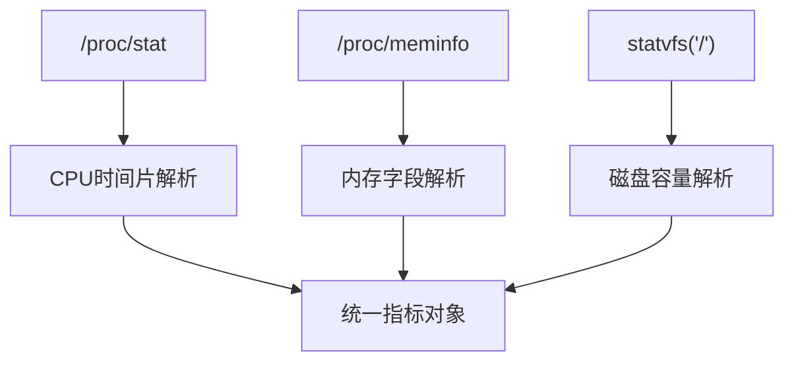
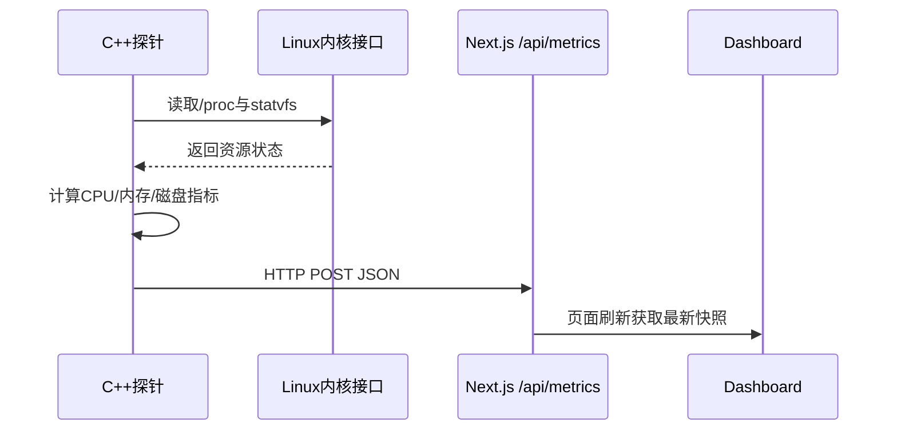
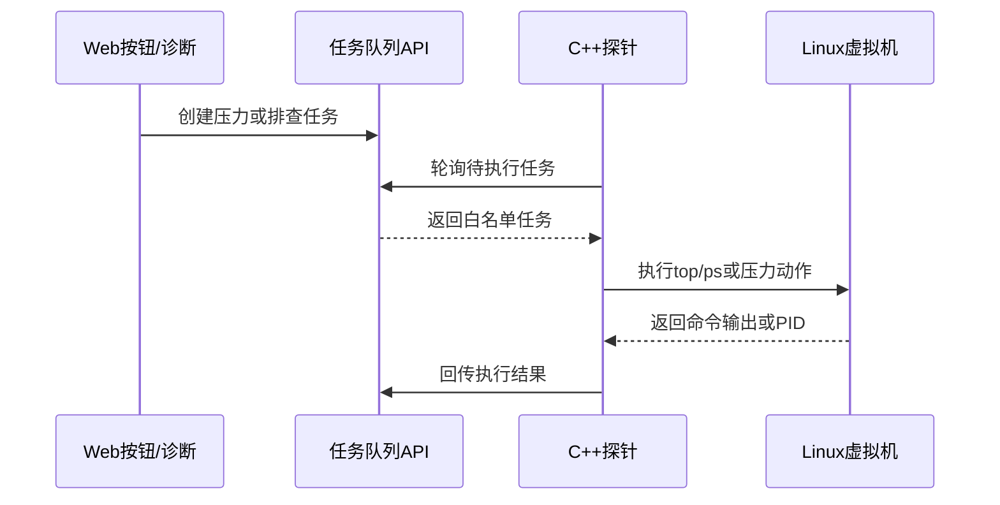
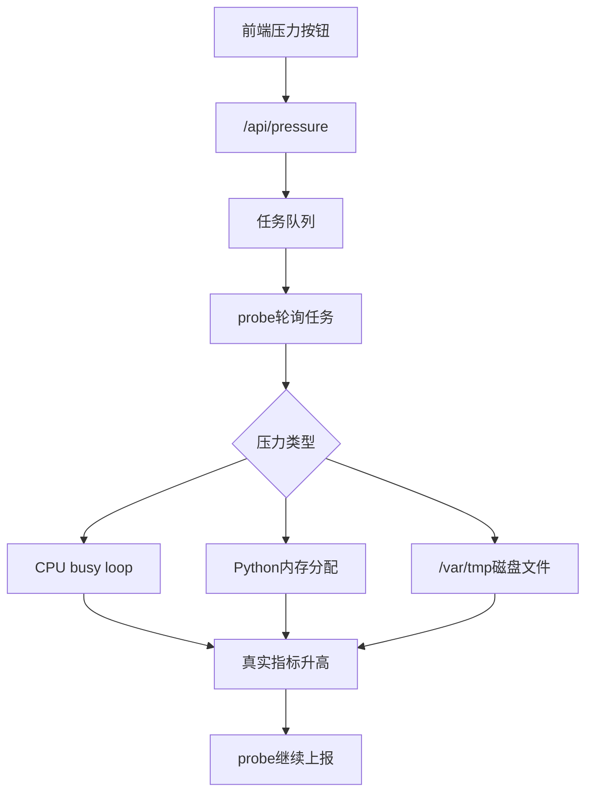
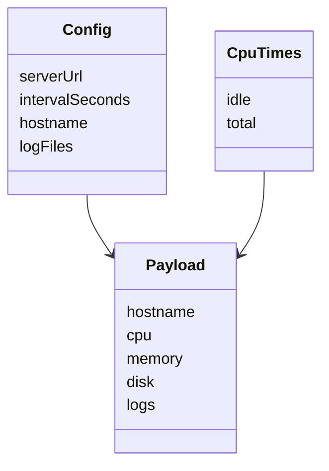

# Linux系统资源监测模块设计

## 摘要

Linux服务器智能运维助手面向中小规模服务器管理场景，尝试将传统系统监控、日志分析和本地大语言模型诊断结合起来，降低管理员发现问题和定位问题的成本。本文重点研究其中的 Linux 系统资源监测模块，围绕 CPU、内存、磁盘三个核心资源指标展开设计与实现。系统探针采用 C++ 编写，通过读取 `/proc/stat`、`/proc/meminfo` 以及 `statvfs` 文件系统接口获取资源状态，并按照配置文件中指定的地址周期性上报到 Web 平台。当前版本还增加了 probe 任务通道：Web 端可以下发白名单只读命令，也可以下发 CPU、内存、磁盘真实压力测试任务，探针在 Linux 虚拟机内执行后回传结果。与直接在页面中伪造指标不同，本系统的趋势图、告警和 AI 诊断均来自虚拟机真实资源变化。本文从需求分析、总体架构、采样算法、数据封装、压力测试和测试结果等方面进行论述，证明该模块能够满足课程项目对 Linux 基础监控能力的要求，并为日志分析和 AI 故障诊断模块提供可靠的数据来源。

## 关键词

Linux；系统监控；C++探针；CPU采样；内存监控；磁盘监控

## Abstract

The Linux intelligent operation and maintenance assistant integrates resource monitoring, log analysis and local LLM-based diagnosis for small and medium server management scenarios. This paper focuses on the Linux resource monitoring module. The probe is implemented in C++ and collects CPU, memory and disk metrics through `/proc/stat`, `/proc/meminfo` and the `statvfs` system call. The collected data is periodically posted to the Next.js platform according to a configurable server URL. The current implementation also supports a probe task channel, through which the web platform can trigger whitelist read-only checks and real CPU, memory and disk pressure tests inside the Linux virtual machine. This paper discusses requirements, architecture, sampling algorithms, data packaging, pressure testing and verification results. The module provides stable and authentic resource data for dashboard visualization, log correlation and AI-assisted fault diagnosis.

## Key words

Linux; system monitoring; C++ probe; CPU sampling; memory monitoring; disk monitoring

## 第一章 绪论

### 1.1 研究背景及意义

Linux 服务器广泛应用于 Web 服务、数据库、容器平台和校园实验环境。对于服务器管理员而言，CPU、内存和磁盘状态是判断系统是否健康的第一入口。当 CPU 长时间高负载时，可能存在计算密集型进程、死循环、异常任务或攻击流量；当内存使用率过高时，可能导致频繁换页、服务响应变慢甚至进程被 OOM Killer 终止；当磁盘空间不足时，日志写入、数据库落盘和软件升级都可能失败。因此，资源监测不是运维系统的附属功能，而是故障诊断的基础数据层。

传统命令行工具如 `top`、`free`、`df` 能够提供即时结果，但它们更适合人工临时排查，不适合自动持续采样。本文设计的资源监测模块把这些命令背后的 Linux 数据来源抽象为一个轻量探针，由探针负责定时采集，再把数据交给平台统一存储、展示和分析。这样既保留了 Linux 原生命令的可解释性，也方便与后续 AI 诊断模块对接。

### 1.2 国内外研究现状

现有监控系统中，Prometheus Node Exporter、Zabbix Agent、Telegraf 等工具已经非常成熟，能够覆盖大量指标并支持告警规则。但对于课程项目而言，直接引入完整工业级监控体系会掩盖 Linux 基础原理和模块实现过程。因此，本项目采用“简化但完整”的路线：只选取最关键的资源指标，用 C++ 从 Linux 系统接口直接采集，并在论文中解释每个指标的来源和含义。

从技术趋势看，监控数据正在从单纯图表展示走向智能分析。管理员不再只希望看到“CPU 90%”，还希望系统回答“为什么 CPU 高、应该执行什么命令、风险在哪里”。资源监测模块因此需要提供结构化、可信、低延迟的数据，为大模型推理提供上下文。

### 1.3 研究目标与内容

本文目标包括：第一，实现能够在 Ubuntu Server ARM64 虚拟机中运行的 C++ 探针；第二，完成 CPU、内存和磁盘三类指标采集；第三，通过配置文件指定上报地址和采样周期；第四，将数据封装为 JSON 并上报到 Web 平台；第五，支持由平台下发真实压力测试任务，用于验证 CPU、内存、磁盘告警是否生效；第六，在论文附录中给出核心代码，体现 Linux 系统资源监测模块的实现亮点。

### 1.4 论文组织结构

全文分为六章。第一章说明研究背景、现状和目标；第二章介绍 Linux 资源监测相关技术；第三章进行需求分析和总体设计；第四章说明核心模块实现；第五章给出测试与效果分析；第六章总结不足和展望。

## 第二章 相关技术概述

### 2.1 `/proc` 虚拟文件系统

Linux 的 `/proc` 是内核向用户态暴露系统运行状态的重要接口。它不是普通磁盘文件，而是内核动态生成的虚拟文件系统。`/proc/stat` 中包含 CPU 时间片累计值，`/proc/meminfo` 中包含物理内存、可用内存、缓存、交换分区等信息。通过读取这些文件，程序可以不依赖外部命令而获得系统状态。

### 2.2 CPU 使用率计算原理

CPU 使用率不能只看某一时刻的绝对值，而需要比较两次采样之间的时间差。探针读取 user、nice、system、idle、iowait、irq、softirq、steal 等字段，计算总时间增量和空闲时间增量，再使用公式：

```text
CPU使用率 = 1 - 空闲时间增量 / 总时间增量
```

该方法与常见监控工具的基本原理一致，适合周期采样。

### 2.3 内存与磁盘监测技术

内存监测主要使用 `MemTotal`、`MemAvailable` 和派生出的 used 值。与简单使用 free 字段相比，`MemAvailable` 更能反映 Linux 页面缓存可回收后的真实可用内存。磁盘监测使用 `statvfs("/")` 获取根分区总块数和可用块数，再计算容量。



## 第三章 系统分析与总体设计

### 3.1 需求分析

资源监测模块的功能性需求包括：能够采集 CPU 使用率、内存总量与可用量、磁盘总量与可用量；能够按照固定周期上报；能够通过配置文件修改上报地址；能够在虚拟机内独立运行；能够响应 Web 平台下发的有限任务。任务分为两类：一类是 `top`、`ps`、`uptime`、`vmstat` 等只读排查命令；另一类是课程演示需要的真实压力测试任务，包括 CPU busy loop、Python 内存占用和 `/var/tmp` 磁盘文件占用。非功能性需求包括：程序体积小、依赖少、便于安装、错误时不中断系统正常运行、数据格式清晰，并且不允许 Web 端执行任意 shell 命令。

### 3.2 总体架构设计



资源监测模块位于整个系统最底层。它不直接处理 AI 问答，也不负责页面展示，而是把 Linux 主机状态转换为统一数据包。Web 平台在收到数据后，既可以用于图表展示，也可以作为 AI 诊断上下文。

当前实现进一步加入任务协同链路。探针每次上报指标后，会主动访问 `/api/probe/tasks/next` 查询是否存在待执行任务。若任务命令在白名单中，探针执行并把输出回传到 `/api/probe/tasks/result`。这种设计让 Web 端能够触发真实排查步骤，但仍由探针限制命令范围，避免将任意命令执行能力暴露给浏览器。



### 3.3 技术方案选型

探针选择 C++17，是因为 C++ 能够方便调用 Linux 系统接口，同时编译后部署简单。网络上报没有引入第三方 HTTP 库，而是使用 socket 构造 HTTP POST 请求，减少安装依赖。配置文件采用简单的 `key=value` 格式，适合课程项目和手动修改。

## 第四章 系统核心模块与实现

### 4.1 配置文件加载

探针默认读取 `/etc/opsai/probe.conf`，也支持在命令行传入路径。配置项包括 `server_url`、`interval_seconds`、`hostname` 和 `log_files`。其中 `server_url` 指向 Web 平台 API，`interval_seconds` 控制采样周期，`hostname` 为空时自动读取系统主机名。

### 4.2 CPU 采样实现

CPU 采样分为读取和计算两步。读取阶段解析 `/proc/stat` 第一行，计算 total 与 idle；计算阶段比较前后两次采样的差值。这样避免了瞬时值波动，也符合监控系统以周期为单位观测资源状态的特点。

### 4.3 内存与磁盘实现

内存模块读取 `/proc/meminfo` 后构建键值表，重点使用 `MemTotal` 和 `MemAvailable`。磁盘模块使用 `statvfs`，以根分区为监测对象。虽然真实生产环境可能需要监控多个挂载点，但对于期末项目和单台 Ubuntu 虚拟机，根分区已经能覆盖主要风险。

### 4.4 数据封装与上报

探针生成 JSON 数据，字段包括 hostname、sentAt、cpu、memory、disk 和 logs。由于项目不引入 JSON 库，代码中实现了必要的字符串转义，保证日志换行和引号不会破坏 JSON 格式。

### 4.5 真实压力测试实现

为避免前端模拟数据造成误导，系统将压力测试放在 Linux 虚拟机内部执行。CPU 压力通过按 CPU 核数启动 busy loop 进程实现；内存压力通过 Python 进程分配约 2.1GB 内存实现；磁盘压力在 `/var/tmp/opsai-disk-pressure.bin` 创建约 4GB 文件实现。停止操作则读取 PID 文件或删除压力文件。该功能使课堂演示可以直接观察资源趋势从正常到异常再恢复的全过程。





## 第五章 系统测试与效果分析

### 5.1 功能测试

测试环境为 macOS 上的 ARM64 Ubuntu Server 虚拟机，根分区约 20GB。启动 Web 平台后，修改探针配置中的 `server_url`，使其指向宿主机可访问的 `/api/metrics`。运行探针后，Dashboard 可以看到 CPU、内存和磁盘指标刷新，说明采集和上报链路有效。进一步点击 Web 中的“真实压力测试”按钮，可以触发虚拟机内部资源变化：CPU 压力启动后 CPU 上报达到 100%；内存压力启动后内存使用率上升到约 66%；磁盘压力启动后根分区使用率从约 16% 上升到约 37%。

### 5.2 异常场景测试

当 Web 平台未启动时，探针上报失败但不会退出，而是在下一周期继续尝试；当日志文件不存在时，探针跳过该文件，不影响资源指标；当配置文件不存在时，探针使用默认配置。这些策略保证了探针的容错性。

### 5.3 效果分析

该模块的优势在于实现简单、数据来源清晰、部署成本低。它不追求覆盖所有 Linux 指标，而是抓住 CPU、内存和磁盘三个最常见故障入口。与早期只给出建议命令的方案相比，当前版本能够实际执行只读排查命令并回传结果，使 AI 模块不再停留在“建议执行 top”，而是可以基于已经执行的 `top`、`ps`、`vmstat` 输出形成结论。

## 第六章 总结与展望

本文完成了 Linux 系统资源监测模块的设计与实现。模块使用 C++ 编写，能够从 Linux 原生接口采集 CPU、内存和磁盘信息，并通过 HTTP JSON 上报到平台。新版实现还支持白名单任务执行和真实压力测试，能够在课程演示中证明数据并非前端模拟，而是来自 Linux 虚拟机真实运行状态。该实现验证了 Linux 资源监控的基本原理，也为日志分析、AI 诊断和可视化模块提供了数据基础。不足之处在于当前仅监控根分区，未加入网络吞吐、磁盘 IO 明细和长期持久化。后续可扩展进程 CPU TopN、网卡吞吐、systemd 服务状态等指标，并支持 TLS、鉴权和批量主机管理。

## 参考文献

[1] Brendan Gregg. Systems Performance: Enterprise and the Cloud. Pearson, 2020.  
[2] Michael Kerrisk. The Linux Programming Interface. No Starch Press, 2010.  
[3] Linux man-pages project. proc(5), statvfs(3).  
[4] Prometheus Node Exporter Documentation.  
[5] Red Hat Enterprise Linux Documentation: Monitoring and managing system status.

## 附录：核心代码

```cpp
static double cpuUsagePercent(const CpuTimes& previous, const CpuTimes& current) {
    const auto totalDelta = current.total - previous.total;
    const auto idleDelta = current.idle - previous.idle;
    if (totalDelta == 0) return 0.0;
    return (1.0 - static_cast<double>(idleDelta) / static_cast<double>(totalDelta)) * 100.0;
}
```

该代码体现了 CPU 使用率监测的关键思想：使用两次 `/proc/stat` 采样之间的增量计算负载，而不是读取单次静态值。

```cpp
static bool isAllowedDiagnosticCommand(const std::string& command) {
    static const std::vector<std::string> allowed{
        "top -b -n 1 | head -20",
        "ps aux --sort=-%cpu | head -10",
        "opsai:pressure:cpu:start",
        "opsai:pressure:memory:start",
        "opsai:pressure:disk:start"
    };
    return std::find(allowed.begin(), allowed.end(), command) != allowed.end();
}
```

该代码体现了新版资源模块的安全边界：Web 平台不能随意控制 Linux 主机，只能通过探针执行预先定义的只读检查和压力测试动作。
