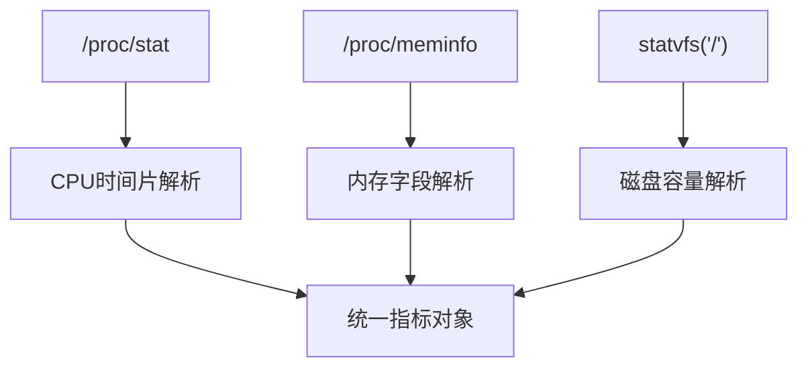
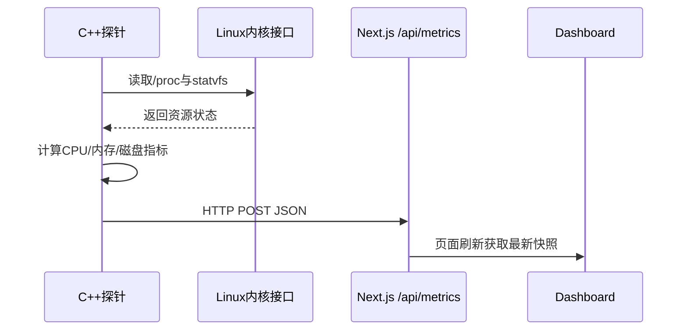
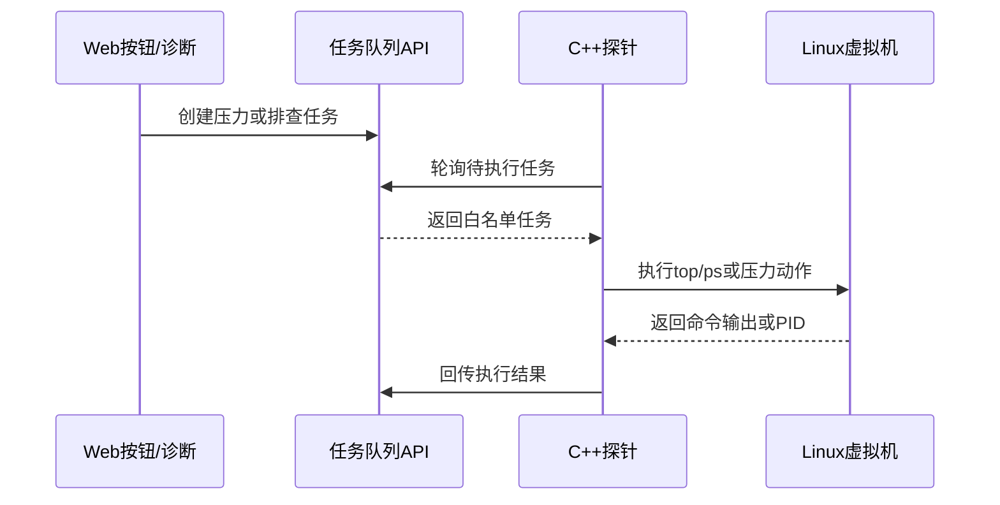
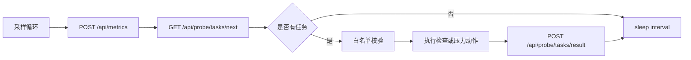
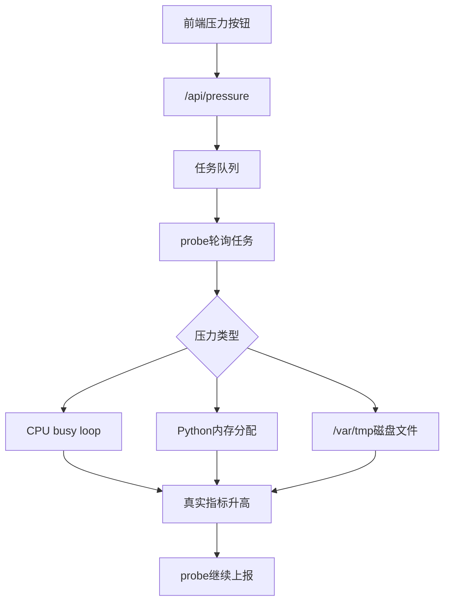
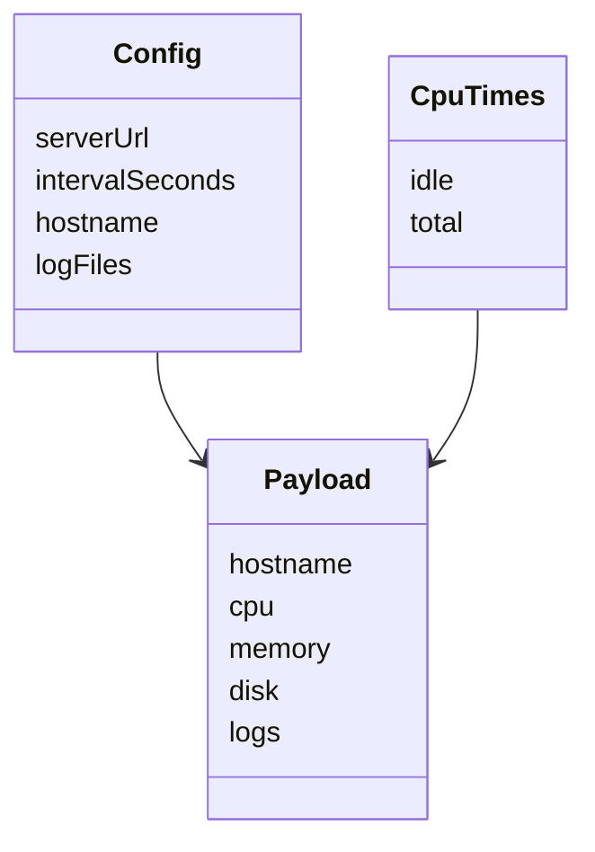

# Linux系统资源监测模块设计

## 摘要

Linux服务器智能运维助手面向中小规模服务器管理场景，尝试将传统系统监控、日志分析和本地大语言模型诊断结合起来，降低管理员发现问题和定位问题的成本。本文重点研究其中的 Linux 系统资源监测模块，围绕 CPU、内存、磁盘三个核心资源指标展开设计与实现。系统探针采用 C++ 编写，通过读取 `/proc/stat`、`/proc/meminfo` 以及 `statvfs` 文件系统接口获取资源状态，并按照配置文件中指定的地址周期性上报到 Web 平台。当前版本还增加了 probe 任务通道：Web 端可以下发白名单只读命令，也可以下发 CPU、内存、磁盘真实压力测试任务，探针在 Linux 虚拟机内执行后回传结果。与直接在页面中伪造指标不同，本系统的趋势图、告警和 AI 诊断均来自虚拟机真实资源变化。本文从需求分析、总体架构、采样算法、数据封装、压力测试和测试结果等方面进行论述，证明该模块能够满足课程项目对 Linux 基础监控能力的要求，并为日志分析和 AI 故障诊断模块提供可靠的数据来源。

项目地址：[SnowballXueQiu/OpsAI-Assistant](https://github.com/SnowballXueQiu/OpsAI-Assistant)

## 关键词

Linux；系统监控；C++探针；CPU采样；内存监控；磁盘监控

## Abstract

The Linux intelligent operation and maintenance assistant integrates resource monitoring, log analysis and local LLM-based diagnosis for small and medium server management scenarios. This paper focuses on the Linux resource monitoring module. The probe is implemented in C++ and collects CPU, memory and disk metrics through `/proc/stat`, `/proc/meminfo` and the `statvfs` system call. The collected data is periodically posted to the Next.js platform according to a configurable server URL. The current implementation also supports a probe task channel, through which the web platform can trigger whitelist read-only checks and real CPU, memory and disk pressure tests inside the Linux virtual machine. This paper discusses requirements, architecture, sampling algorithms, data packaging, pressure testing and verification results. The module provides stable and authentic resource data for dashboard visualization, log correlation and AI-assisted fault diagnosis.

Project repository: [SnowballXueQiu/OpsAI-Assistant](https://github.com/SnowballXueQiu/OpsAI-Assistant)

## Key words

Linux; system monitoring; C++ probe; CPU sampling; memory monitoring; disk monitoring

## 第一章 绪论

### 1.1 研究背景及意义

Linux 服务器广泛应用于 Web 服务、数据库、容器平台和校园实验环境。对于服务器管理员而言，CPU、内存和磁盘状态是判断系统是否健康的第一入口。当 CPU 长时间高负载时，可能存在计算密集型进程、死循环、异常任务或攻击流量；当内存使用率过高时，可能导致频繁换页、服务响应变慢甚至进程被 OOM Killer 终止；当磁盘空间不足时，日志写入、数据库落盘和软件升级都可能失败。因此，资源监测不是运维系统的附属功能，而是故障诊断的基础数据层。

传统命令行工具如 `top`、`free`、`df` 能够提供即时结果，但它们更适合人工临时排查，不适合自动持续采样。本文设计的资源监测模块把这些命令背后的 Linux 数据来源抽象为一个轻量探针，由探针负责定时采集，再把数据交给平台统一存储、展示和分析。这样既保留了 Linux 原生命令的可解释性，也方便与后续 AI 诊断模块对接。

### 1.2 国内外研究现状

现有监控系统中，Prometheus Node Exporter、Zabbix Agent、Telegraf 等工具已经非常成熟，能够覆盖大量指标并支持告警规则[1][4][5][9]。但对于课程项目而言，直接引入完整工业级监控体系会弱化 Linux 基础原理和模块实现过程。因此，本项目采用“轻量但闭环”的路线：选取 CPU、内存、磁盘等关键指标，用 C++ 从 Linux 系统接口直接采集，并在论文中解释每个指标的来源和含义[7][8]。

从技术趋势看，监控数据正在从单纯图表展示走向智能分析。管理员不再只希望看到“CPU 90%”，还希望系统回答“为什么 CPU 高、应该执行什么命令、风险在哪里”。资源监测模块因此需要提供结构化、可信、低延迟的数据，为大模型推理提供上下文。

### 1.3 研究目标与内容

本文目标包括：第一，实现能够在 Ubuntu Server ARM64 虚拟机中运行的 C++ 探针；第二，完成 CPU、内存和磁盘三类指标采集；第三，通过配置文件指定上报地址和采样周期；第四，将数据封装为 JSON 并上报到 Web 平台；第五，支持由平台下发真实压力测试任务，用于验证 CPU、内存、磁盘告警是否生效；第六，在论文附录中给出核心代码，体现 Linux 系统资源监测模块的实现亮点。

### 1.4 论文组织结构

全文分为六章。第一章说明研究背景、现状和目标；第二章介绍 Linux 资源监测相关技术；第三章进行需求分析和总体设计；第四章说明核心模块实现；第五章给出测试与效果分析；第六章总结不足和展望。

### 1.5 课题场景与实现边界

本课题不是面向大型企业机房的完整监控平台，而是面向 Linux 结课作业中的单机服务器智能运维场景。因此，设计时没有追求 Prometheus、Zabbix、Grafana 等成熟平台的全部能力，而是从 Linux 原生接口出发，实现采样、封装、上报和诊断联动流程。这样设计能够使系统资源指标的来源更加清晰：CPU 使用率来自 `/proc/stat` 的时间片增量，内存可用量来自 `/proc/meminfo`，磁盘容量来自文件系统统计接口，Web 页面中的趋势曲线也能够与虚拟机真实状态相互验证[7][8]。

从课程展示角度看，资源监测模块至少需要回答三个问题。第一，系统有没有真正运行在 Linux 虚拟机中；第二，页面展示的数据是不是来自真实主机；第三，当资源异常出现时，系统是否能通过进一步检查给出可验证的结论。围绕这三个问题，本文实现的探针必须具备持续运行能力、周期上报能力、压力测试配合能力和白名单命令执行能力。持续运行保证趋势图能够不断刷新；周期上报保证 Web 平台掌握最近状态；压力测试保证演示时可以人为制造真实异常；白名单命令执行则保证 AI 分析时不是凭空推断，而是有 `top`、`ps`、`vmstat` 等命令输出作为证据。

在实现边界上，本模块不负责长期数据存储，不实现多主机注册和权限体系，也不实现复杂的服务发现。原因是期末项目的重点在于“Linux + AI”的完整闭环，而不是替代工业级监控平台。若一次性加入过多生产级功能，反而会降低代码可读性和实验可复现性。因此系统采用内存快照保存最近指标，前端展示最近趋势，AI 分析使用当前快照和最近若干次采样。该边界能够保证系统实现与课程目标保持一致，也使资源监测、日志分析、AI 诊断和 Web 展示之间的接口更加明确。

### 1.6 资源监测在智能运维中的位置

智能运维系统通常需要经历“感知、判断、解释、处置”四个阶段。资源监测模块属于最前端的感知层，它采集 CPU、内存、磁盘等底层信号；日志模块属于事件证据层，它记录服务、认证和错误信息；AI 诊断模块属于判断与解释层，它把指标、日志和命令输出组织成可读结论；Web 展示模块则承担交互和结果呈现。若资源监测模块不可靠，后续所有分析都会失去基础。例如 CPU 实际已经满载但探针仍上报 5%，AI 即使再强也会得出错误判断；磁盘空间不足但前端曲线来自随机数据，演示时就无法体现真实 Linux 故障排查过程。

因此，本文把“真实性”作为资源监测模块的核心质量目标。真实性不是单一指标，而是包括采样来源真实、压力行为真实、趋势变化真实、诊断证据真实。采样来源真实要求数据来自 `/proc` 和系统调用；压力行为真实要求点击按钮后确实在虚拟机内占用资源；趋势变化真实要求页面只展示 probe 上报的数据；诊断证据真实要求 AI 看到的是 probe 执行后的命令输出。通过这四个层次，系统能够避免课程项目中常见的“页面好看但没有真实后端”的问题。

## 第二章 相关技术概述

### 2.1 `/proc` 虚拟文件系统

Linux 的 `/proc` 是内核向用户态暴露系统运行状态的重要接口。它不是普通磁盘文件，而是内核动态生成的虚拟文件系统。`/proc/stat` 中包含 CPU 时间片累计值，`/proc/meminfo` 中包含物理内存、可用内存、缓存、交换分区等信息。通过读取这些文件，程序可以不依赖外部命令而获得系统状态。

### 2.2 CPU 使用率计算原理

CPU 使用率不能只看某一时刻的绝对值，而需要比较两次采样之间的时间差。探针读取 user、nice、system、idle、iowait、irq、softirq、steal 等字段，计算总时间增量和空闲时间增量，再使用公式[7][8]：

$$
\mathrm{CPU使用率}=1-\frac{\Delta \mathrm{Idle}}{\Delta \mathrm{Total}}
$$

该方法与常见监控工具的基本原理一致，适合周期采样。

### 2.3 内存与磁盘监测技术

内存监测主要使用 `MemTotal`、`MemAvailable` 和派生出的 used 值。与简单使用 free 字段相比，`MemAvailable` 更能反映 Linux 页面缓存可回收后的真实可用内存。磁盘监测使用 `statvfs("/")` 获取根分区总块数和可用块数，再计算容量。

图一 CPU、内存与磁盘指标统一采集流程图



### 2.4 负载均值与 CPU 使用率的区别

Linux 运维中经常同时观察 CPU 使用率和 Load Average，但二者含义并不完全相同。CPU 使用率反映采样周期内 CPU 时间被非空闲任务占用的比例，适合判断处理器是否繁忙；Load Average 表示一定时间窗口内处于可运行状态和不可中断睡眠状态的任务平均数量，常见窗口为 1 分钟、5 分钟和 15 分钟。单核系统中，Load Average 接近 1 可以理解为 CPU 基本满载；多核系统中，需要结合 CPU 核数判断。例如 4 核虚拟机的 1 分钟负载为 4 左右时，说明可运行任务数量与 CPU 并行处理能力接近。

本项目在上报数据中同时保留 CPU 使用率和 Load Average，原因是两类指标可以相互校验。若 CPU 使用率很高而 Load Average 也持续升高，通常说明计算任务较多；若 CPU 使用率不高但 Load Average 高，可能存在 I/O 等待、磁盘阻塞或不可中断状态任务；若 CPU 短时升高但 5 分钟和 15 分钟负载较低，往往只是瞬时波动。AI 诊断模块在分析“为什么 CPU 占用高”时，会同时读取当前 CPU、最近 30 次平均值、最高值和负载均值，从而避免把短暂抖动误判为故障。

### 2.5 Linux 资源文件的可解释性

选择 `/proc` 和系统调用作为采样来源，还有一个重要原因是可解释性强。管理员可以直接在虚拟机中执行 `cat /proc/stat`、`cat /proc/meminfo`、`df -h` 等命令验证探针结果。相比某些封装较深的第三方库，原生接口更适合本课程设计场景。CPU 百分比由两次 `/proc/stat` 的 CPU 累计时间差计算得到；内存可用量采用 `MemAvailable`，更接近 Linux 页面缓存可回收后的实际可用资源；磁盘监控选择根分区，是因为当前虚拟机采用单根分区部署，根分区空间直接影响日志写入、软件安装和系统运行[7][8]。

### 2.6 Agent 模式与安全控制

服务器监控系统常见架构包括无 Agent 模式和 Agent 模式。无 Agent 模式通常依赖 SSH、SNMP 或云厂商接口拉取数据，部署简单但受权限、网络和协议限制较大。Agent 模式是在被监控主机上安装探针，由探针主动采集并上报，优点是能够访问本机细节、上报周期稳定、扩展本地检查能力[2][3]。本文采用 Agent 模式，即 C++ probe 常驻 Linux 虚拟机中运行。它不仅能读取资源指标，还能执行预置的压力测试动作和白名单检查命令。

Agent 模式需要格外注意安全边界。若 Web 端可以任意传入 shell 命令，则一旦页面或接口被误用，就可能对虚拟机造成破坏。因此本项目将任务分为“任务名称”和“白名单命令”两层。Web 端只能创建预定义任务，probe 端再次检查命令字符串是否属于允许集合。即便前端被修改，探针也不会执行不在白名单中的命令。该设计虽然简单，却体现了运维系统中最基本的最小权限思想。

### 2.7 监控数据的时序特征

资源指标天然具有时序属性。单个采样点只能说明某一瞬间状态，不能说明问题是否持续。例如 CPU 某一秒达到 95%，可能只是编译、压缩或系统更新导致的短时波动；若连续十几次采样都保持高位，则更可能是异常进程或业务压力。因此 Web 平台保存最近一段时间的采样点，AI 诊断时不仅读取最新值，还计算平均值、最大值和变化趋势[1][5]。

本文的趋势窗口没有使用数据库，而是保存在 Next.js 服务进程内存中。这种设计不适合长期生产监控，但非常适合课程项目：实现简单、延迟低、无需额外安装数据库，并且足够支撑“启动压力-观察趋势-停止压力-观察恢复”的演示流程。若未来扩展为多主机平台，可以将该内存窗口替换为 SQLite、InfluxDB、Prometheus 或 TimescaleDB 等持久化存储。

## 第三章 系统分析与总体设计

### 3.1 需求分析

资源监测模块的功能性需求包括：能够采集 CPU 使用率、内存总量与可用量、磁盘总量与可用量；能够按照固定周期上报；能够通过配置文件修改上报地址；能够在虚拟机内独立运行；能够响应 Web 平台下发的有限任务。任务分为两类：一类是 `top`、`ps`、`uptime`、`vmstat` 等只读排查命令；另一类是课程演示需要的真实压力测试任务，包括 CPU busy loop、Python 内存占用和 `/var/tmp` 磁盘文件占用。非功能性需求包括：程序体积小、依赖少、便于安装、错误时不中断系统正常运行、数据格式清晰，并且不允许 Web 端执行任意 shell 命令。

### 3.2 总体架构设计

图二 资源监测数据上报时序图



资源监测模块位于整个系统最底层。它不直接处理 AI 问答，也不负责页面展示，而是把 Linux 主机状态转换为统一数据包。Web 平台在收到数据后，既可以用于图表展示，也可以作为 AI 诊断上下文。

当前实现进一步加入任务协同链路。探针每次上报指标后，会主动访问 `/api/probe/tasks/next` 查询是否存在待执行任务。若任务命令在白名单中，探针执行并把输出回传到 `/api/probe/tasks/result`。这种设计让 Web 端能够触发真实排查步骤，但仍由探针限制命令范围，避免将任意命令执行能力暴露给浏览器。

图三 Web 下发任务与 probe 执行回传时序图



### 3.3 技术方案选型

探针选择 C++17，是因为 C++ 能够方便调用 Linux 系统接口，同时编译后部署简单。网络上报没有引入第三方 HTTP 库，而是使用 socket 构造 HTTP POST 请求，减少安装依赖。配置文件采用简单的 `key=value` 格式，适合课程项目和实验环境修改[6][7]。

### 3.4 模块接口设计

资源监测模块对外提供的核心接口是 HTTP JSON 上报。探针并不关心 Web 端如何保存数据，也不关心页面如何绘制图表，只负责按统一结构发送快照。一个典型上报包包含主机名、发送时间、CPU 百分比、负载均值、内存总量、内存可用量、磁盘总量、磁盘可用量、进程 TopN 和日志摘要。Web 端接收后将其写入内存中的 ring buffer，Dashboard 每隔数秒请求最新状态并刷新页面。

任务接口采用 probe 主动轮询，而不是 Web 主动连接 probe。这样做是因为虚拟机通常位于 NAT 网络后，宿主机不一定能直接访问虚拟机内部端口；而 probe 访问宿主机的 Next.js API 更简单。具体流程为：probe 上报指标后请求 `/api/probe/tasks/next`；若返回空任务，则进入下一轮睡眠；若返回任务，则检查白名单、执行、截断输出并 POST 到 `/api/probe/tasks/result`。该模式与许多实际 Agent 平台类似，即由 Agent 主动连接控制端，减少网络暴露面[2][3]。

图四 采样上报与任务轮询执行流程图



### 3.5 数据质量设计

资源监控数据最怕“看起来有数据但没有意义”。因此本项目在数据质量上做了三个约束。第一，前端没有模拟指标；如果 probe 未上报，页面显示等待真实数据，而不是创建随机曲线。第二，压力测试不直接修改前端状态，而是在虚拟机中实际占用 CPU、内存或磁盘，等待下一次 probe 上报后页面自然变化。第三，AI 诊断不只使用当前点位，还使用最近样本均值和最高值，从时间窗口上判断异常是否持续。

这些约束使得系统演示更接近真实运维过程。例如点击“启动 CPU 压力”后，前端按钮并不会直接把 CPU 设置为 100%，而是创建任务；probe 轮询到任务后在 Linux 内部启动 busy loop；随后 `/proc/stat` 中的非 idle 时间增量增加；下一轮上报中 CPU 使用率升高；Dashboard 曲线再展示变化。整个链路较长，但每一步都可验证，能够证明资源趋势来自真实操作系统。

### 3.6 异常阈值设计

告警阈值是资源监测模块和可视化模块之间的重要接口。本文采用相对保守的阈值：CPU 当前值或最近均值超过较高比例时提示 CPU 压力；内存使用率超过阈值时提示内存压力；磁盘使用率超过阈值时提示空间风险。阈值没有做得过于复杂，是因为课程项目更强调链路闭环而不是告警策略调优。对于真实生产环境，阈值应结合业务负载、历史基线、服务类型和时间周期进行设置。例如数据库服务器内存高并不一定异常，因为缓存命中率可能更重要；构建服务器 CPU 短时间满载也可能是正常任务。

本项目的 AI 诊断会在阈值基础上做二次判断。如果 CPU 当前值很低，但用户询问“为什么 CPU 占用高”，AI 会说明根据最近采样并未发现高占用，并列出已执行的 `top`、`ps`、`vmstat` 结果；如果用户先启动压力按钮，采样窗口出现连续高位，AI 则会结合命令输出指出高占用进程或压力任务。这种设计避免了简单阈值告警的机械性，也体现了资源模块与 AI 模块之间的互补。

## 第四章 系统核心模块与实现

### 4.1 配置文件加载

探针默认读取 `/etc/opsai/probe.conf`，也支持在命令行传入路径。配置项包括 `server_url`、`interval_seconds`、`hostname` 和 `log_files`。其中 `server_url` 指向 Web 平台 API，`interval_seconds` 控制采样周期，`hostname` 为空时自动读取系统主机名。

### 4.2 CPU 采样实现

CPU 采样分为读取和计算两步。读取阶段解析 `/proc/stat` 第一行，计算 total 与 idle；计算阶段比较前后两次采样的差值。这样避免了瞬时值波动，也符合监控系统以周期为单位观测资源状态的特点。

### 4.3 内存与磁盘实现

内存模块读取 `/proc/meminfo` 后构建键值表，重点使用 `MemTotal` 和 `MemAvailable`。磁盘模块使用 `statvfs`，以根分区为监测对象。虽然真实生产环境可能需要监控多个挂载点，但对于期末项目和单台 Ubuntu 虚拟机，根分区已经能覆盖主要风险。

### 4.4 数据封装与上报

探针生成 JSON 数据，字段包括 hostname、sentAt、cpu、memory、disk 和 logs。由于项目不引入 JSON 库，代码中实现了必要的字符串转义，保证日志换行和引号不会破坏 JSON 格式。

### 4.5 真实压力测试实现

为避免前端模拟数据造成误导，系统将压力测试放在 Linux 虚拟机内部执行。CPU 压力通过按 CPU 核数启动 busy loop 进程实现；内存压力通过 Python 进程分配约 2.1GB 内存实现；磁盘压力在 `/var/tmp/opsai-disk-pressure.bin` 创建约 4GB 文件实现。停止操作则读取 PID 文件或删除压力文件。该功能使课堂演示可以直接观察资源趋势从正常到异常再恢复的全过程。

图五 真实压力测试任务执行流程图



图六 资源监测核心数据结构类图



### 4.6 进程 TopN 采集

仅有系统级 CPU、内存百分比还不足以定位问题。管理员看到 CPU 或内存高时，第一反应通常是查看哪个进程占用资源。因此 probe 增加了 TopN 进程摘要。实现时遍历 `/proc` 下数字目录，读取每个进程的 `status` 或 `stat` 信息，提取 PID、进程名、RSS 等字段，再按内存占用排序取前若干项。对于 CPU 进程占比，当前版本主要依赖诊断任务中的 `ps aux --sort=-%cpu | head -10` 输出，因为进程级 CPU 需要对每个进程做两次时间片采样，复杂度高于系统级 CPU。课程项目中采用“系统级 CPU 周期采样 + 进程级命令诊断”的方式，能够兼顾实现难度和排查效果。

进程 TopN 对内存压力测试特别有价值。启动内存压力后，系统指标只能说明内存使用率上升，而 TopN 能进一步显示 Python 压力进程 RSS 增大。AI 诊断模块结合这两类证据，可以得出“内存压力由测试进程造成”的结论，而不是泛泛建议检查服务。

### 4.7 HTTP 上报实现细节

为了减少依赖，探针没有使用 curl 库或第三方 HTTP 客户端，而是使用 POSIX socket 自行构造 HTTP 请求。实现步骤包括解析 `server_url`，建立 TCP 连接，写入请求行、Header 和 JSON Body，然后读取响应状态码。最初实现中曾在写入后立即 `shutdown(SHUT_WR)`，在 Next.js 开发服务器场景下会导致响应读取不完整；修正后改为完整写入请求并正常读取响应，保证 `status=200` 能被正确识别。

该问题说明底层网络细节对 Agent 稳定性有直接影响。监控探针是长期运行程序，不能只考虑“能发出去一次”，还要考虑服务端响应、失败重试、超时和错误日志。当前实现对上报失败采取保守策略：打印错误并进入下一轮循环，不因为一次网络失败退出。对于课程项目而言，这种容错已经足够；若进一步生产化，可以加入指数退避、批量缓存和 TLS 证书校验。

### 4.8 安装与配置方式

探针可通过 CMake 编译为单个可执行文件，放入 Ubuntu 虚拟机后配合 `/etc/opsai/probe.conf` 运行。配置文件示例如下：

```ini
server_url=http://10.0.2.2:3001/api/metrics
interval_seconds=3
hostname=opsai-vm
log_files=/var/log/syslog,/var/log/auth.log
```

其中 `10.0.2.2` 是 QEMU 用户网络中虚拟机访问宿主机的地址，`3001` 是 Next.js 开发服务器端口。由于用户使用 macOS 和 ARM64 Ubuntu 虚拟机，本项目的测试环境与最终演示环境一致，避免了 x86 与 ARM 架构差异带来的部署问题。

实际课程展示时，可以将 probe 制作为简单 Debian 包，使其安装到 `/usr/local/bin/opsai-probe`，配置文件安装到 `/etc/opsai/probe.conf`，systemd 服务文件安装到 `/etc/systemd/system/opsai-probe.service`。这样探针能够通过 `systemctl start opsai-probe` 启动，并在虚拟机重启后自动运行。虽然本项目不强制完成完整软件仓库发布，但这种安装结构符合 Linux 软件部署习惯。

### 4.9 采样循环实现

采样循环是 probe 的主干。程序启动后首先读取配置，再读取一次 CPU 基准值，然后进入循环。每轮循环执行资源采样、日志摘要、JSON 封装、HTTP 上报、任务轮询、任务执行和睡眠。把任务轮询放在指标上报之后，是为了让 Web 端先拿到最新状态，再决定是否需要下发检查任务；同时也避免任务执行时间影响首次指标展示。

采样周期默认设置为 3 秒。这个值在课程演示中比较合适：如果周期太短，会增加 Web 请求频率，也会让页面刷新过快；如果周期太长，点击压力按钮后需要等待较久才能看到曲线变化。3 秒能够较快体现资源趋势，又不会对虚拟机造成明显负担。对于真实服务器，可以根据监控目的设置不同频率：秒级监控适合故障现场，分钟级监控适合长期趋势，小时级监控适合容量规划。

## 第五章 系统测试与效果分析

### 5.1 功能测试

测试环境为 macOS 上的 ARM64 Ubuntu Server 虚拟机，根分区约 20GB。启动 Web 平台后，修改探针配置中的 `server_url`，使其指向宿主机可访问的 `/api/metrics`。运行探针后，Dashboard 可以看到 CPU、内存和磁盘指标刷新，说明采集和上报链路有效。进一步点击 Web 中的“真实压力测试”按钮，可以触发虚拟机内部资源变化：CPU 压力启动后 CPU 上报达到 100%；内存压力启动后内存使用率上升到约 66%；磁盘压力启动后根分区使用率从约 16% 上升到约 37%。

### 5.2 异常场景测试

当 Web 平台未启动时，探针上报失败但不会退出，而是在下一周期继续尝试；当日志文件不存在时，探针跳过该文件，不影响资源指标；当配置文件不存在时，探针使用默认配置。这些策略保证了探针的容错性。

### 5.3 效果分析

该模块的优势在于实现简单、数据来源清晰、部署成本低。它不追求覆盖所有 Linux 指标，而是抓住 CPU、内存和磁盘三个最常见故障入口。与早期只给出建议命令的方案相比，当前版本能够实际执行只读排查命令并回传结果，使 AI 模块不再停留在“建议执行 top”，而是可以基于已经执行的 `top`、`ps`、`vmstat` 输出形成结论。

### 5.4 压力测试过程分析

CPU 压力测试采用多进程 busy loop。启动后，probe 记录压力进程 PID，并在停止任务中读取 PID 文件逐一终止。该方式的优点是实现简单、效果明显、便于清理。测试中 CPU 使用率可以升至接近 100%，Dashboard 趋势图随下一轮采样快速上升；停止后，CPU 曲线回落到正常水平。该结果说明 CPU 采样算法能够反映真实运行压力。

内存压力测试采用 Python 分配大块 bytearray 的方式实现。与单纯写入文件不同，内存压力需要进程持续持有对象，否则内存会被释放。测试中内存使用率从正常状态上升到约 66%，TopN 进程中可观察到 Python 进程 RSS 增大。停止后 probe 终止该进程，内存占用逐步回落。该测试验证了 `MemAvailable` 作为可用内存指标的合理性，也验证了进程 TopN 对定位内存占用来源的作用。

磁盘压力测试最初选择 `/tmp`，但 Ubuntu 虚拟机中 `/tmp` 可能是 tmpfs，容量较小且占用的是内存文件系统，不适合模拟根分区磁盘不足。修正后改为在 `/var/tmp/opsai-disk-pressure.bin` 创建 4GB 文件。测试中根分区使用率从约 16% 上升到约 37%，停止后删除压力文件并恢复。这个过程说明磁盘监控应关注实际挂载点，不能只凭路径名称判断空间来源。

### 5.5 与中文文献工作的对比

张嘉豪等提出的 SMS 服务器监控管理系统强调轻量级、跨平台、可扩展和实时反馈，为中小规模服务器监控提供了系统化思路[3]。本文实现与其目标相似，都关注轻量部署和实时状态获取；不同之处在于本文更强调 Linux 底层采样原理，使用 C++ 直接读取 `/proc` 与文件系统接口，并服务于 AI 运维诊断场景。吴建明等关于 Prometheus 的服务器监控研究说明工业系统中时序监控和告警平台具有较强实用价值[4]，但课程项目若直接套用完整 Prometheus 生态，可能难以体现底层实现。因此本文借鉴“指标采集-上报-展示-告警”的总体思想，而在实现上保持轻量化和可解释[9]。

从系统边界看，数据中心资源监控类研究通常面向多节点、长期存储和复杂告警[1][5]；本文面向单台 Linux 虚拟机和课程演示，更重视从采样到诊断的端到端闭环。两者并不矛盾：本项目可以作为大型监控体系的轻量化实验实现，后续若扩展多主机、时序数据库和告警规则，可以自然过渡到更接近生产环境的形态。

### 5.6 测试结论

综合测试表明，资源监测模块已经达到课程项目预期。第一，probe 能够在 Ubuntu ARM64 虚拟机中持续运行，并稳定向宿主机 Next.js 平台上报；第二，CPU、内存、磁盘三类核心指标均能随真实压力变化；第三，Web 平台在没有真实数据时不会显示假曲线；第四，压力任务和诊断任务均通过白名单控制，避免任意命令执行；第五，AI 诊断能够使用已执行命令结果，而不是只给出命令建议。

不足也比较明确。当前资源采样没有保存到数据库，服务重启后历史趋势会丢失；磁盘监控只覆盖根分区，未覆盖多个挂载点；进程 CPU TopN 依赖 `ps` 命令输出，尚未完全由 probe 内部计算；网络流量、磁盘 I/O、systemd 服务状态等指标还没有纳入。对于期末作业而言，这些不足不会影响核心演示，但为后续扩展提供了方向。

## 第六章 总结与展望

本文完成了 Linux 系统资源监测模块的设计与实现。模块使用 C++ 编写，能够从 Linux 原生接口采集 CPU、内存和磁盘信息，并通过 HTTP JSON 上报到平台。新版实现还支持白名单任务执行和真实压力测试，能够在课程演示中证明数据并非前端模拟，而是来自 Linux 虚拟机真实运行状态。该实现验证了 Linux 资源监控的基本原理，也为日志分析、AI 诊断和可视化模块提供了数据基础。不足之处在于当前仅监控根分区，未加入网络吞吐、磁盘 IO 明细和长期持久化。后续可扩展进程 CPU TopN、网卡吞吐、systemd 服务状态等指标，并支持 TLS、鉴权和批量主机管理。

## 参考文献

[1] 台宪青,吴梦悦,马玉峰,等.数据中心服务器资源监控系统的设计与实现[J].计算机应用与软件,2019,36(07):14-20.  
[2] 徐波,王建英.服务器监控系统实现方案[J].电脑编程技巧与维护,2019(03):43-45.  
[3] 张嘉豪,赵亮,翁铭隆,等.基于SSM+SpringBoot技术实现服务器监控的研究[J].科学技术创新,2020(33):101-102.  
[4] 吴建明,许辉,孙圣明.基于Prometheus的高炉控制系统服务器监控[J].冶金设备,2022(06):113-117.  
[5] 胡鹤,赵毅,牛铁,等.面向集群服务器系统的监控平台综述[J].科研信息化技术与应用,2018,9(01):79-88.  
[6] 程源.服务器监控系统的研究与实现[M].武汉:华中科技大学,2005.  
[7] Kerrisk M. The Linux Programming Interface[M]. San Francisco: No Starch Press,2010.  
[8] Linux man-pages project. proc(5), statvfs(3)[EB/OL]. https://man7.org/linux/man-pages/.  
[9] Prometheus Authors. Node Exporter Documentation[EB/OL]. https://prometheus.io/docs/.

## 附录：核心代码

```cpp
static double cpuUsagePercent(const CpuTimes& previous, const CpuTimes& current) {
    const auto totalDelta = current.total - previous.total;
    const auto idleDelta = current.idle - previous.idle;
    if (totalDelta == 0) return 0.0;
    return (1.0 - static_cast<double>(idleDelta) / static_cast<double>(totalDelta)) * 100.0;
}
```

该代码体现了 CPU 使用率监测的关键思想：使用两次 `/proc/stat` 采样之间的增量计算负载，而不是读取单次静态值。

```cpp
static bool isAllowedDiagnosticCommand(const std::string& command) {
    static const std::vector<std::string> allowed{
        "top -b -n 1 | head -20",
        "ps aux --sort=-%cpu | head -10",
        "opsai:pressure:cpu:start",
        "opsai:pressure:memory:start",
        "opsai:pressure:disk:start"
    };
    return std::find(allowed.begin(), allowed.end(), command) != allowed.end();
}
```

该代码体现了新版资源模块的安全边界：Web 平台不能随意控制 Linux 主机，只能通过探针执行预先定义的只读检查和压力测试动作。

```cpp
static std::optional<Task> fetchNextTask(const Config& config) {
    const auto response = httpGet(config.taskNextUrl());
    if (response.status != 200 || response.body.empty()) return std::nullopt;
    Task task;
    task.id = extractJsonString(response.body, "id");
    task.command = extractJsonString(response.body, "command");
    task.title = extractJsonString(response.body, "title");
    if (task.id.empty() || task.command.empty()) return std::nullopt;
    return task;
}
```

该代码体现了 probe 主动轮询任务的模式。Web 平台不直接连接虚拟机端口，而是由 probe 在每轮采样后主动获取任务，适合 QEMU NAT 网络环境。

```cpp
static CommandResult runPressureTask(const std::string& command) {
    if (command == "opsai:pressure:cpu:start") return startCpuPressure();
    if (command == "opsai:pressure:cpu:stop") return stopCpuPressure();
    if (command == "opsai:pressure:memory:start") return startMemoryPressure();
    if (command == "opsai:pressure:memory:stop") return stopMemoryPressure();
    if (command == "opsai:pressure:disk:start") return startDiskPressure();
    if (command == "opsai:pressure:disk:stop") return stopDiskPressure();
    return {1, "unknown pressure command"};
}
```

该代码展示了压力测试并非前端模拟，而是 probe 收到任务后在 Linux 主机中执行真实资源占用动作。

```cpp
static DiskInfo readDiskInfo(const std::string& mountPoint) {
    struct statvfs stat {};
    if (statvfs(mountPoint.c_str(), &stat) != 0) {
        return {};
    }
    const auto total = static_cast<unsigned long long>(stat.f_blocks) * stat.f_frsize;
    const auto available = static_cast<unsigned long long>(stat.f_bavail) * stat.f_frsize;
    return DiskInfo{total, available, total > available ? total - available : 0};
}
```

该代码体现了磁盘监测的核心实现：通过文件系统统计接口获取真实挂载点容量，而不是解析 `df` 命令文本。
