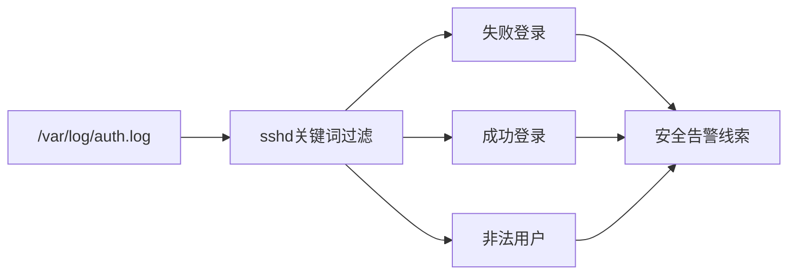
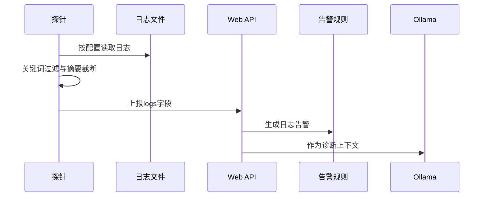
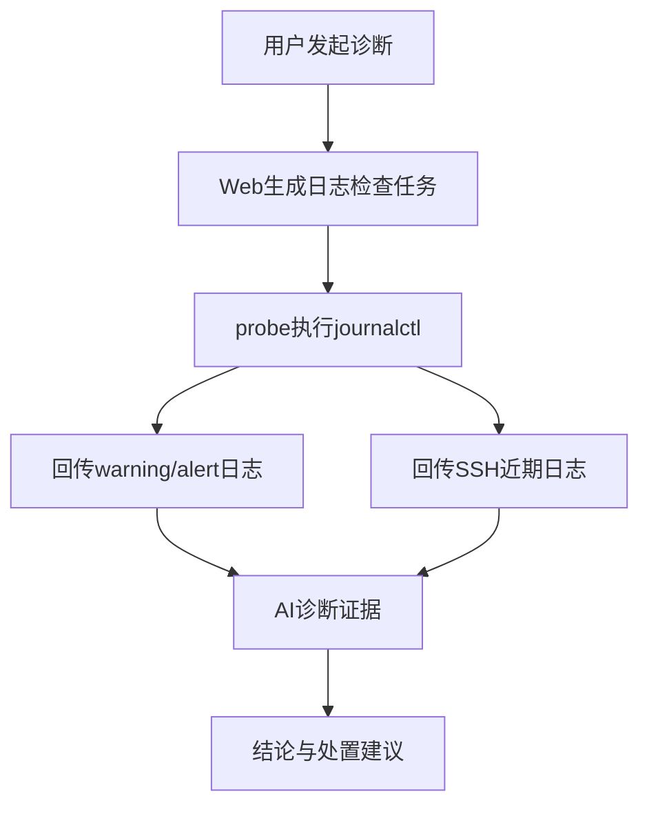
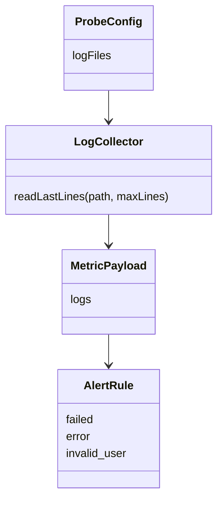

# Linux日志采集与分析技术研究

## 摘要

日志是 Linux 服务器故障排查中最重要的证据来源之一。与 CPU、内存等数值指标相比，日志能够记录服务启动、认证失败、权限提升、系统错误和异常访问等事件，具有更强的上下文表达能力。本文围绕 Linux服务器智能运维助手中的日志分析模块展开研究，重点设计 Syslog 解析、SSH 日志分析和自动排查命令输出整合功能。系统探针在采集资源指标的同时，会读取配置文件中指定的日志文件，从 `/var/log/syslog`、`/var/log/auth.log` 等文件中筛选包含 sshd、sudo、failed、error 等关键词的记录，并将摘要与资源指标一起上报到 Web 平台。当前版本还支持在诊断时由 Web 下发 `journalctl` 只读任务，探针在虚拟机内执行后回传近期 warning、alert 和 SSH 服务日志，使 AI 诊断能够基于“已执行检查”而不是单纯建议。本文分析了 Linux 日志体系、日志采集流程、关键词过滤策略、SSH 安全事件识别方法和测试效果。该模块虽然保持轻量化，但能够覆盖课程项目中常见的登录失败、服务错误、权限操作和压力测试过程中的系统线索，为智能运维诊断提供文本证据。

## 关键词

Linux日志；Syslog；SSH日志；日志分析；故障诊断；智能运维

## Abstract

Logs are one of the most important evidence sources for Linux server troubleshooting. Compared with numeric metrics such as CPU and memory usage, logs contain richer context about service startup, authentication failures, privilege escalation, system errors and abnormal access. This paper focuses on the log collection and analysis module of the Linux intelligent operation and maintenance assistant. The probe reads configured log files such as `/var/log/syslog` and `/var/log/auth.log`, filters records containing keywords such as sshd, sudo, failed and error, and posts the summary together with resource metrics to the web platform. The current version also integrates automatic `journalctl` checks during AI diagnosis, allowing the model to analyze real command outputs instead of merely recommending commands. This lightweight module covers common course-project scenarios including login failures, service errors, SSH events and pressure-test evidence.

## Key words

Linux logs; Syslog; SSH logs; log analysis; fault diagnosis; intelligent operations

## 第一章 绪论

### 1.1 研究背景及意义

在 Linux 运维中，许多故障不能只通过资源指标判断。例如 CPU 占用升高可能来自业务高峰，也可能来自异常脚本；SSH 登录失败可能是用户输错密码，也可能是暴力破解；服务启动失败可能是配置错误，也可能是端口冲突。日志能够提供“发生了什么”的事件记录，是连接现象与原因的重要桥梁。

本项目的日志分析模块服务于“智能运维助手”主题：管理员输入问题后，系统不仅展示资源状态，还提供最近日志摘要，使 AI 诊断不只依赖单一指标。对于期末项目而言，日志模块不需要实现复杂日志平台，而应体现 Linux 日志来源、采集方法、基础解析和安全事件识别能力。

### 1.2 研究现状

工业界常见日志平台包括 ELK、Loki、Graylog、Splunk 等，它们支持海量日志采集、索引、检索和告警。然而这些平台部署复杂，课程项目中不宜照搬。Linux 原生日志体系主要由 syslog、rsyslog、systemd-journald 以及各服务日志组成，其中 `/var/log/auth.log` 常用于记录 SSH 和 sudo 事件，`/var/log/syslog` 常用于记录系统级服务信息。本文采用文件读取与关键词过滤方式实现轻量日志摘要，既便于理解也便于运行。

### 1.3 研究目标与内容

日志模块目标包括：识别常见日志文件；筛选 SSH、sudo、failed、error 等关键事件；将日志摘要与资源指标一同上报；在 Web 平台形成告警线索；在诊断过程中补充执行 `journalctl` 检查；为 AI 诊断提供上下文。本文重点讨论 Syslog、SSH 日志解析和轻量命令输出整合，而不扩展到大规模索引系统。

### 1.4 论文组织结构

全文共六章，依次介绍背景意义、相关技术、系统设计、核心实现、测试效果和总结展望。

## 第二章 相关技术概述

### 2.1 Linux 日志体系

Linux 日志来源多样，包括内核日志、系统服务日志、安全认证日志和应用日志。传统发行版常通过 rsyslog 将日志写入 `/var/log`，新版本系统也大量使用 systemd-journald。Ubuntu Server 中常见文件包括 `/var/log/syslog`、`/var/log/auth.log`、`/var/log/kern.log` 等。

### 2.2 Syslog 日志格式

Syslog 通常包含时间、主机名、进程名、进程号和消息内容。例如：

```text
Jun 04 10:30:15 ubuntu sshd[1204]: Failed password for invalid user test from 192.168.64.1 port 53000 ssh2
```

该行可以提取时间、服务 `sshd`、事件类型 `Failed password`、用户名和来源 IP。课程项目中不做完整正则解析，而是通过关键词快速提取可疑行，降低实现复杂度。

### 2.3 SSH 安全日志

SSH 是服务器远程管理的核心入口。常见日志事件包括 Accepted publickey、Failed password、Invalid user、authentication failure、session opened、session closed 等。连续失败可能意味着暴力破解，异常 IP 成功登录则可能意味着账号泄露。



## 第三章 系统分析与总体设计

### 3.1 需求分析

日志模块需要满足四类需求。第一，采集需求：能够读取配置中的日志文件，缺失文件不导致程序崩溃。第二，分析需求：能够识别 SSH、sudo、failed、error 等常见运维线索。第三，联动需求：日志摘要能够进入 Web 平台，并被 AI 诊断使用。第四，自动检查需求：当用户发起诊断时，系统可以下发 `journalctl -p warning..alert`、`journalctl -u ssh` 等只读命令，由 probe 在 Linux 主机上执行并回传结果。

### 3.2 总体流程



探针只保留最近若干条相关日志，避免一次性上传过多文本。Web 平台不对原始日志做复杂存储，而是在内存快照中保存最近记录，适合课程展示。

在新版诊断闭环中，日志模块还负责提供“检查结果证据”。当用户询问 CPU、SSH 或磁盘异常时，Web 端不再只让 AI 建议管理员手动执行命令，而是把日志检查命令放入任务队列。probe 轮询后执行命令，并把输出作为诊断上下文的一部分交给 Ollama。



### 3.3 数据结构设计

日志摘要作为 `logs` 字段嵌入资源上报 JSON。这样做有两个好处：一是采集链路简单；二是 AI 诊断时可以同时看到指标和日志，不需要再额外请求日志接口。

## 第四章 系统核心模块与实现

### 4.1 日志文件配置

配置项 `log_files=/var/log/syslog,/var/log/auth.log` 支持多个路径。探针启动后将逗号分隔的字符串解析为数组。不同发行版日志文件路径可能不同，因此配置化比硬编码更灵活。

### 4.2 关键词过滤

当前实现关注五类关键词：`sshd`、`error`、`failed`、`Failed`、`sudo`。这些词覆盖了 SSH 登录、安全认证、系统错误和权限操作。过滤逻辑简单但有效，符合课程项目对轻量实现的要求。

### 4.3 摘要截断

探针只保留每个文件最近 12 条相关日志，避免日志过大影响网络上报和页面展示。由于日志分析的重点是“最近发生的异常”，这种截断策略具有合理性。

### 4.4 Web 告警联动

Web 平台在 `buildAlerts` 中使用正则检测 `failed|error|invalid user|authentication failure`。一旦命中，页面展示“日志中出现失败、错误或 SSH 异常登录线索”。该规则虽然简单，但能直观体现日志模块对运维判断的价值。

### 4.5 与压力测试场景的日志关联

当前系统提供 CPU、内存、磁盘三类真实压力按钮。日志模块在这些场景中具有辅助判断作用：CPU 压力主要通过 `top` 和 `ps` 输出定位；内存压力会在进程 TopN 中出现 Python 进程 RSS 增大，若触发 OOM 也会在系统日志中留下线索；磁盘压力在 `/var/tmp` 创建 4GB 文件，如果空间不足或写入失败，`df` 输出和日志均可作为证据。因此日志模块不仅用于安全分析，也用于解释压力测试期间系统行为是否异常。



## 第五章 系统测试与效果分析

### 5.1 Syslog 测试

在 Ubuntu 虚拟机中启动服务、执行 sudo 命令或手动制造错误日志后，探针能够读取到相关行并上报。Dashboard 的日志摘要区域能够显示来源文件名和日志内容，说明 Syslog 采集流程可用。进一步在 Web 端发起 AI 诊断时，平台会下发 `journalctl -p warning..alert --since '10 minutes ago' -n 30 --no-pager`，probe 执行后回传近期系统告警，使诊断报告能够明确说明“已执行检查”。

### 5.2 SSH 日志测试

通过宿主机连接虚拟机 SSH，成功登录时会出现 Accepted publickey 或 session opened；使用错误用户名或密码时会出现 Failed password 或 invalid user。探针过滤后，Web 告警区域能够提示存在 SSH 异常线索。诊断接口还会下发 `journalctl -u ssh --since '30 minutes ago' -n 30 --no-pager`，用于核实近期 SSH 服务日志是否只有正常登录退出，还是存在失败认证和异常来源。

### 5.3 分析效果

日志模块与 AI 诊断结合后，回答更接近真实运维过程。例如用户问“为什么 CPU 占用高”，系统会实际执行 CPU 排查命令，同时补充近期 warning 日志和 SSH 日志；如果日志中存在大量 sshd 失败登录，AI 可以提示检查安全攻击或认证服务压力；如果日志显示某服务反复重启，则 AI 可以引用对应 `journalctl` 输出。相比只生成“建议命令”，新版模块已经能把日志检查结果纳入最终结论。

## 第六章 总结与展望

本文完成了 Linux 日志采集与分析模块的设计。模块通过读取 Syslog 和 SSH 认证日志，筛选关键事件并上报到平台，为告警展示和 AI 诊断提供文本证据。新版实现还通过任务队列接入 `journalctl` 自动检查，使日志分析从静态摘要扩展为诊断过程中的实时证据获取。其优点是实现轻量、可解释、易部署；不足是没有完整解析字段、没有日志持久化索引、没有按 IP 统计失败次数。后续可加入正则解析、IP 频次统计、journald 原生接口、日志级别分类和安全告警规则，使系统更接近真实运维平台。

## 参考文献

[1] Linux man-pages project. syslog(2), journalctl documentation.  
[2] Ubuntu Server Guide: Logging and monitoring.  
[3] OpenSSH Project Manual Pages.  
[4] Rainer Gerhards. The Syslog Protocol and rsyslog documentation.  
[5] Elastic Observability Documentation.

## 附录：核心代码

```cpp
static std::string readLastLines(const std::string& path, int maxLines) {
    std::ifstream file(path);
    if (!file.good()) return "";
    std::vector<std::string> lines;
    std::string line;
    while (std::getline(file, line)) {
        if (line.find("sshd") != std::string::npos ||
            line.find("error") != std::string::npos ||
            line.find("failed") != std::string::npos ||
            line.find("Failed") != std::string::npos ||
            line.find("sudo") != std::string::npos) {
            lines.push_back(line);
            if (lines.size() > static_cast<size_t>(maxLines)) lines.erase(lines.begin());
        }
    }
    std::ostringstream out;
    for (const auto& item : lines) out << item << "\\n";
    return out.str();
}
```

该代码体现了日志模块的核心思想：从日志文件中筛选与运维和安全相关的最近事件，为平台提供简洁上下文。

```ts
if (/ssh|日志|登录|失败|异常|error|failed/.test(lower)) {
  add("journal_warnings", "近期系统告警日志");
  add("ssh_recent", "近期 SSH 日志");
}
```

该代码体现了新版日志模块与自动诊断的结合：当问题涉及日志或 SSH 时，系统会主动把日志检查命令加入任务队列，由 probe 执行后返回真实输出。
