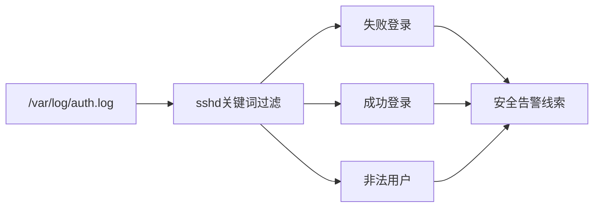
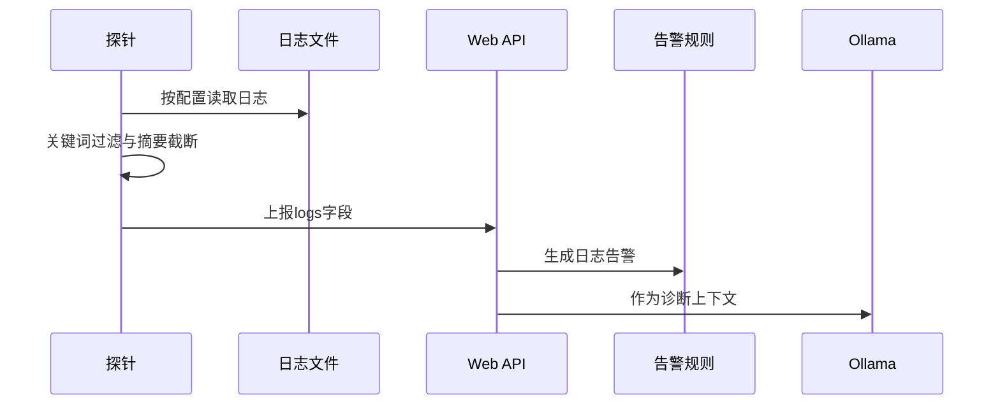
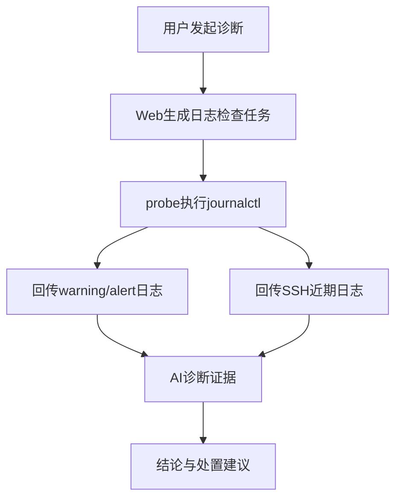
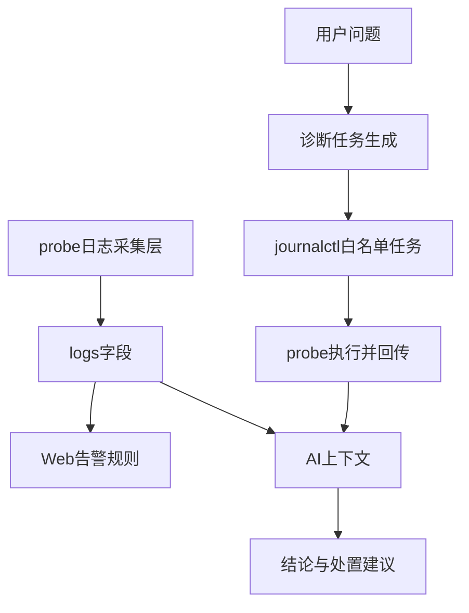
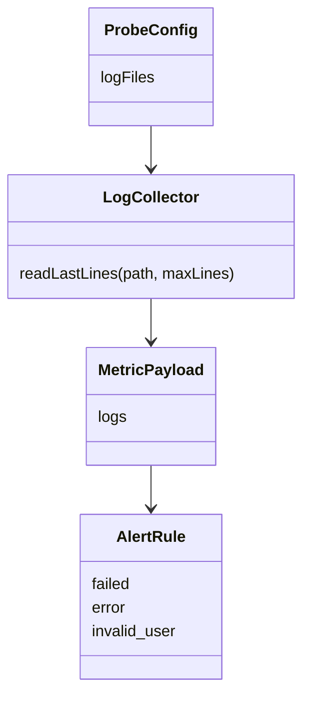

# Linux日志采集与分析技术研究

## 摘要

日志是 Linux 服务器故障排查中最重要的证据来源之一。与 CPU、内存等数值指标相比，日志能够记录服务启动、认证失败、权限提升、系统错误和异常访问等事件，具有更强的上下文表达能力。本文围绕 Linux服务器智能运维助手中的日志分析模块展开研究，重点设计 Syslog 解析、SSH 日志分析和自动排查命令输出整合功能。系统探针在采集资源指标的同时，会读取配置文件中指定的日志文件，从 `/var/log/syslog`、`/var/log/auth.log` 等文件中筛选包含 sshd、sudo、failed、error 等关键词的记录，并将摘要与资源指标一起上报到 Web 平台。当前版本还支持在诊断时由 Web 下发 `journalctl` 只读任务，探针在虚拟机内执行后回传近期 warning、alert 和 SSH 服务日志，使 AI 诊断能够基于“已执行检查”而不是单纯建议。本文分析了 Linux 日志体系、日志采集流程、关键词过滤策略、SSH 安全事件识别方法和测试效果。该模块虽然保持轻量化，但能够覆盖课程项目中常见的登录失败、服务错误、权限操作和压力测试过程中的系统线索，为智能运维诊断提供文本证据。

项目地址：[SnowballXueQiu/OpsAI-Assistant](https://github.com/SnowballXueQiu/OpsAI-Assistant)

## 关键词

Linux日志；Syslog；SSH日志；日志分析；故障诊断；智能运维

## Abstract

Logs are one of the most important evidence sources for Linux server troubleshooting. Compared with numeric metrics such as CPU and memory usage, logs contain richer context about service startup, authentication failures, privilege escalation, system errors and abnormal access. This paper focuses on the log collection and analysis module of the Linux intelligent operation and maintenance assistant. The probe reads configured log files such as `/var/log/syslog` and `/var/log/auth.log`, filters records containing keywords such as sshd, sudo, failed and error, and posts the summary together with resource metrics to the web platform. The current version also integrates automatic `journalctl` checks during AI diagnosis, allowing the model to analyze real command outputs instead of merely recommending commands. This lightweight module covers common course-project scenarios including login failures, service errors, SSH events and pressure-test evidence.

Project repository: [SnowballXueQiu/OpsAI-Assistant](https://github.com/SnowballXueQiu/OpsAI-Assistant)

## Key words

Linux logs; Syslog; SSH logs; log analysis; fault diagnosis; intelligent operations

## 第一章 绪论

### 1.1 研究背景及意义

在 Linux 运维中，许多故障不能只通过资源指标判断。例如 CPU 占用升高可能来自业务高峰，也可能来自异常脚本；SSH 登录失败可能是用户输错密码，也可能是暴力破解；服务启动失败可能是配置错误，也可能是端口冲突。日志能够提供“发生了什么”的事件记录，是连接现象与原因的重要桥梁。

本项目的日志分析模块服务于“智能运维助手”主题：管理员输入问题后，系统不仅展示资源状态，还提供最近日志摘要，使 AI 诊断不只依赖单一指标。对于期末项目而言，日志模块不需要实现复杂日志平台，而应体现 Linux 日志来源、采集方法、基础解析和安全事件识别能力。

### 1.2 研究现状

工业界常见日志平台包括 ELK、Loki、Graylog、Splunk 等，它们支持海量日志采集、索引、检索和告警。已有研究也指出，大规模软件系统日志量庞大、结构化不足，人工分析效率较低[2]。Linux 原生日志体系主要由 syslog、rsyslog、systemd-journald 以及各服务日志组成，其中 `/var/log/auth.log` 常用于记录 SSH 和 sudo 事件，`/var/log/syslog` 常用于记录系统级服务信息[5][6][7]。本文采用文件读取与关键词过滤方式实现轻量日志摘要，既便于理解也便于运行。

### 1.3 研究目标与内容

日志模块目标包括：识别常见日志文件；筛选 SSH、sudo、failed、error 等关键事件；将日志摘要与资源指标一同上报；在 Web 平台形成告警线索；在诊断过程中补充执行 `journalctl` 检查；为 AI 诊断提供上下文。本文重点讨论 Syslog、SSH 日志解析和轻量命令输出整合，而不扩展到大规模索引系统。

### 1.4 论文组织结构

全文共六章，依次介绍背景意义、相关技术、系统设计、核心实现、测试效果和总结展望。

### 1.5 日志分析在本项目中的定位

在“Linux服务器智能运维助手”中，日志分析模块位于资源监控和 AI 诊断之间。资源监控告诉系统“现在 CPU、内存、磁盘是否异常”，日志分析则进一步说明“异常附近发生过什么事件”。例如 CPU 高占用时，资源模块可以给出 CPU 百分比和进程列表；日志模块可以补充近期是否有服务重启、认证失败、系统 warning 或错误信息。AI 诊断模块需要同时读取两类证据，才能给出更接近真实运维的判断。

本项目没有把日志模块设计成完整的 ELK 或 Loki 平台，而是围绕课程目标实现轻量采集与诊断联动。具体而言，日志模块完成三项任务：第一，probe 周期性读取配置文件指定的日志文件，把最近相关日志随指标一起上报；第二，Web 端根据日志内容生成简单告警，如失败登录、错误、异常认证等；第三，当用户发起 AI 分析时，Web 端创建 `journalctl` 白名单任务，由 probe 在 Linux 虚拟机内执行并返回真实输出。这样既能体现 Linux 日志文件分析，也能体现 systemd-journald 的实时查询能力[5]。

日志模块还承担“证据补强”作用。资源指标只能说明系统状态发生了变化，日志与命令输出则用于解释变化附近发生的事件。当前版本会在诊断过程中执行 `journalctl -p warning..alert` 和 `journalctl -u ssh` 等命令，把近期系统告警和 SSH 服务日志纳入上下文。最终回答可以写出“已执行检查、检查结果、结论、解决办法”，而不是只生成命令清单[4][5]。

### 1.6 日志分析的难点

日志分析看似只是读取文本，但实际存在多个难点。第一，日志来源分散。传统 Syslog 文件、systemd journal、应用服务日志、安全认证日志可能位于不同位置；不同发行版路径也不同，例如 Ubuntu 使用 `/var/log/auth.log`，而 Red Hat 系列常见 `/var/log/secure`。第二，日志格式不完全统一。Syslog 行通常有时间、主机、进程名和消息内容，但应用日志可能自定义格式。第三，日志量可能很大，若每次上报完整文件，会造成网络负担和页面噪声。第四，日志语义依赖上下文，同一句 warning 在不同服务中可能含义不同。

针对这些难点，本文采用“配置化路径 + 关键词过滤 + 最近摘要 + 诊断命令补充”的方法。配置化路径解决发行版差异；关键词过滤降低实现复杂度；最近摘要避免上传过量日志；诊断命令补充则用于获取 systemd journal 中更完整的近期事件。该方案不追求复杂日志解析算法，但能够覆盖本项目演示中的关键场景[1][2]。

## 第二章 相关技术概述

### 2.1 Linux 日志体系

Linux 日志来源多样，包括内核日志、系统服务日志、安全认证日志和应用日志。传统发行版常通过 rsyslog 将日志写入 `/var/log`，新版本系统也大量使用 systemd-journald。Ubuntu Server 中常见文件包括 `/var/log/syslog`、`/var/log/auth.log`、`/var/log/kern.log` 等[5][6][7]。

### 2.2 Syslog 日志格式

Syslog 通常包含时间、主机名、进程名、进程号和消息内容。例如：

```text
Jun 04 10:30:15 ubuntu sshd[1204]: Failed password for invalid user test from 192.168.64.1 port 53000 ssh2
```

该行可以提取时间、服务 `sshd`、事件类型 `Failed password`、用户名和来源 IP。课程项目中不做完整正则解析，而是通过关键词快速提取可疑行，降低实现复杂度。

### 2.3 SSH 安全日志

SSH 是服务器远程管理的核心入口。常见日志事件包括 Accepted publickey、Failed password、Invalid user、authentication failure、session opened、session closed 等。连续失败可能意味着暴力破解，异常 IP 成功登录则可能意味着账号泄露[4]。

图一 SSH 日志关键词过滤与安全线索生成流程图



### 2.4 systemd-journald 与 journalctl

现代 Linux 发行版普遍使用 systemd，日志不再只依赖传统文本文件。systemd-journald 会收集内核、服务、用户会话和标准输出等多类日志，管理员可以使用 `journalctl` 按时间、服务、级别、启动轮次等条件查询。相比直接读取 `/var/log/syslog`，`journalctl` 的优势是过滤能力更强，例如可以使用 `journalctl -u ssh` 只查看 SSH 服务日志，使用 `journalctl -p warning..alert` 查看 warning 及以上级别消息[5]。

本项目同时使用文本日志和 `journalctl`。周期采集阶段读取配置中的文件，保证即使不触发诊断也能在 Dashboard 上看到最近日志摘要；AI 诊断阶段执行 `journalctl`，保证分析时获取更及时、更有针对性的证据。二者互相补充：文本日志适合持续摘要，`journalctl` 适合按问题即时查询。

### 2.5 日志关键词与语义线索

课程项目中的日志分析不需要覆盖所有语义，但需要能够识别常见风险线索。本文选择的关键词包括 `sshd`、`sudo`、`failed`、`Failed`、`error`、`invalid user`、`authentication failure` 等。它们分别对应 SSH 服务、权限提升、失败事件、错误信息和异常认证。关键词规则虽然简单，但具有较强可解释性，管理员可以直接在日志中看到匹配内容。

关键词过滤的局限也需要说明。第一，它可能漏报没有包含关键词的异常；第二，它可能误报正常 warning；第三，它不能自动统计来源 IP、失败次数和时间间隔。因此本项目把关键词过滤定位为“线索提取”，而不是最终判定。最终诊断仍需要结合资源指标、命令输出和 AI 推理。这样的定位符合轻量模块实际能力，也避免夸大系统功能。

### 2.6 日志与安全审计

Linux 安全审计通常关注登录、提权、文件访问、服务变更等事件。在本项目中，SSH 和 sudo 是最重要的两类审计线索。SSH 日志可以判断是否存在失败密码、非法用户、公钥登录、会话打开和关闭；sudo 日志可以判断普通用户是否执行了特权命令。虽然系统没有实现完整 auditd 审计，但通过 auth 日志和 journalctl 已经能覆盖课程演示中的基础安全场景。

例如，当用户询问“SSH日志里有没有异常”时，系统会读取最近上报日志，并触发 `journalctl -u ssh --since '30 minutes ago' -n 30 --no-pager`。如果输出中出现大量 `Failed password` 或 `Invalid user`，AI 可以提示可能存在暴力破解尝试，并建议检查来源 IP、关闭密码登录、使用密钥认证、限制防火墙规则；如果只有正常的 publickey 登录和 session closed，则可以说明近期未发现明显 SSH 异常。

## 第三章 系统分析与总体设计

### 3.1 需求分析

日志模块需要满足四类需求。第一，采集需求：能够读取配置中的日志文件，缺失文件不导致程序崩溃。第二，分析需求：能够识别 SSH、sudo、failed、error 等常见运维线索。第三，联动需求：日志摘要能够进入 Web 平台，并被 AI 诊断使用。第四，自动检查需求：当用户发起诊断时，系统可以下发 `journalctl -p warning..alert`、`journalctl -u ssh` 等只读命令，由 probe 在 Linux 主机上执行并回传结果。

### 3.2 总体流程

图二 日志采集、告警联动与 AI 诊断时序图



探针只保留最近若干条相关日志，避免一次性上传过多文本。Web 平台不对原始日志做复杂存储，而是在内存快照中保存最近记录，适合课程展示。

在新版诊断闭环中，日志模块还负责提供“检查结果证据”。当用户询问 CPU、SSH 或磁盘异常时，Web 端不再只让 AI 建议管理员执行命令，而是把日志检查命令放入任务队列。probe 轮询后执行命令，并把输出作为诊断上下文的一部分交给 Ollama[5]。

图三 AI 诊断触发日志自动检查流程图



### 3.3 数据结构设计

日志摘要作为 `logs` 字段嵌入资源上报 JSON。这样做有两个好处：一是采集链路简单；二是 AI 诊断时可以同时看到指标和日志，不需要再额外请求日志接口。

### 3.4 日志模块架构设计

日志模块由三个层次组成。第一层是 probe 采集层，负责读取日志文件、筛选关键词、截断为最近记录，并把结果放入指标 JSON。第二层是 Web 规则层，负责在 Dashboard 上生成日志告警，并在 AI 分析时根据用户问题创建日志检查任务。第三层是 AI 解释层，负责把日志摘要和命令输出转换为自然语言结论。

图四 日志模块三层架构与诊断闭环图



这种架构的优点是职责清晰。probe 不进行复杂推理，只负责采集和执行白名单检查；Web 不直接解析所有日志语义，只负责规则提示和任务编排；AI 不直接连接服务器，只基于平台提供的证据进行诊断。三层之间通过 JSON 数据和任务结果传递，降低了耦合度。

### 3.5 自动检查任务设计

自动检查任务是本项目相对于普通日志摘要的增强功能。当用户问题中包含“日志、SSH、登录、失败、异常、error、failed”等词语时，Web 端会创建日志相关任务；当问题涉及 CPU、内存、磁盘时，系统也会附加近期 warning 日志检查，以便发现服务错误或系统异常。任务创建后不会立即在 Web 端执行 shell，而是放入内存队列，等待 probe 轮询。

日志检查任务主要包括两类：一类是系统告警日志，如 `journalctl -p warning..alert --since '10 minutes ago' -n 30 --no-pager`；另一类是 SSH 服务日志，如 `journalctl -u ssh --since '30 minutes ago' -n 30 --no-pager`。这两条命令都是只读查询，不会修改系统状态，适合加入白名单。probe 执行后会把标准输出、退出码和任务标题回传，AI 分析时将其标注为“已执行检查”。

### 3.6 日志数据截断策略

日志文件可能非常大，如果每轮采集都从头到尾读取并上传，会造成明显性能浪费。已有研究表明，大规模系统日志需要经过分类、筛选或模式挖掘后才便于分析[2][3]。当前 probe 采用简单策略：读取文件时只保留匹配关键词的最近若干行，超过最大行数后删除最早记录。虽然读取整个文件的方式在超大日志场景下效率不高，但对于课程虚拟机和少量日志文件已经足够。后续可以优化为记录文件偏移量，只读取新增部分；也可以使用 journald API 或 `tail` 式增量读取[5]。

摘要截断还可以降低 AI 上下文长度。大语言模型分析时，如果输入包含大量无关日志，反而可能忽略关键证据。本文只保留最近、相关、可解释的日志行，使 AI 更容易围绕问题给出结论。对于“SSH 是否异常”这类问题，最近 30 条 SSH 日志通常已经足以判断是否存在明显失败登录；对于长期攻击趋势，则需要进一步加入统计功能。

## 第四章 系统核心模块与实现

### 4.1 日志文件配置

配置项 `log_files=/var/log/syslog,/var/log/auth.log` 支持多个路径。探针启动后将逗号分隔的字符串解析为数组。不同发行版日志文件路径可能不同，因此配置化比硬编码更灵活[6][7]。

### 4.2 关键词过滤

当前实现关注五类关键词：`sshd`、`error`、`failed`、`Failed`、`sudo`。这些词覆盖了 SSH 登录、安全认证、系统错误和权限操作。过滤逻辑简单但有效，符合课程项目对轻量实现的要求。

### 4.3 摘要截断

探针只保留每个文件最近 12 条相关日志，避免日志过大影响网络上报和页面展示。由于日志分析的重点是“最近发生的异常”，这种截断策略具有合理性。

### 4.4 Web 告警联动

Web 平台在 `buildAlerts` 中使用正则检测 `failed|error|invalid user|authentication failure`。一旦命中，页面展示“日志中出现失败、错误或 SSH 异常登录线索”。该规则虽然简单，但能直观体现日志模块对运维判断的价值。

### 4.5 与压力测试场景的日志关联

当前系统提供 CPU、内存、磁盘三类真实压力按钮。日志模块在这些场景中具有辅助判断作用：CPU 压力主要通过 `top` 和 `ps` 输出定位；内存压力会在进程 TopN 中出现 Python 进程 RSS 增大，若触发 OOM 也会在系统日志中留下线索；磁盘压力在 `/var/tmp` 创建 4GB 文件，如果空间不足或写入失败，`df` 输出和日志均可作为证据。因此日志模块不仅用于安全分析，也用于解释压力测试期间系统行为是否异常。

图五 日志采集与告警规则类关系图



### 4.6 SSH 日志识别规则

SSH 日志分析是 B 模块最有代表性的功能。当前系统重点识别以下模式：`Accepted publickey` 表示密钥登录成功；`Failed password` 表示密码认证失败；`Invalid user` 表示尝试使用不存在账号登录；`session opened` 和 `session closed` 表示会话打开和关闭；`Disconnected from` 表示连接断开。单条失败日志不一定是攻击，但短时间内大量失败、多个非法用户名或异常来源 IP 就值得关注[4]。

在课程展示中，可以通过宿主机尝试错误用户名登录虚拟机来制造 SSH 异常线索。probe 周期采集 auth 日志后，Dashboard 会显示相关行；用户点击“SSH日志里有没有异常？”后，系统执行 `journalctl -u ssh` 并把输出交给 AI。AI 若看到失败认证，就应给出“存在 SSH 异常尝试”的结论；若只看到正常登录和退出，则应说明“近期未发现明显异常”。这种回答方式比固定模板更贴近真实排查。

### 4.7 Web 告警规则实现

Web 端的日志告警规则主要用于页面提示，不替代 AI 诊断。规则通过正则表达式扫描最近日志，若发现 `failed`、`error`、`invalid user`、`authentication failure` 等词，就生成一条告警。告警文本保持简短，提示管理员查看日志详情或发起 AI 诊断。这样设计的原因是 Dashboard 应适合快速浏览，不应在告警区展示过长分析。

日志告警与资源告警可以同时出现。例如启动磁盘压力后，如果系统日志出现写入失败或空间不足，页面既可能显示磁盘空间风险，也可能显示日志错误线索。AI 分析时会把二者合并：资源指标说明磁盘使用率升高，日志说明是否已经影响服务写入。通过这种方式，日志模块不再是孤立文本列表，而是参与整体故障判断。

### 4.8 命令输出整合

日志模块的另一项实现重点是命令输出整合。Web 端发起诊断后，会把任务结果整理为结构化上下文，包括任务标题、命令、退出码和输出片段。AI prompt 要求模型必须区分“已执行检查”和“后续复核命令”。前者是 probe 已经执行并返回的证据，后者只是管理员可选操作。这个约束解决了早期回答中“建议执行命令但并未执行”的问题。

对于日志分析而言，命令输出整合尤其重要。因为 `journalctl` 的结果通常比静态日志摘要更及时，且能按服务或级别过滤。AI 如果看到 `journalctl -u ssh` 输出为空或只有正常 session，就不能夸大风险；如果看到 warning 日志中有服务反复失败，则需要把服务名、时间点和可能影响写清楚。这样的分析方式更符合运维中的证据链思维。

### 4.9 与资源模块的数据联动

日志模块与资源模块并不是简单并列关系，而是相互解释关系。资源模块负责发现“数值异常”，日志模块负责发现“事件异常”。当 CPU 高但日志平稳时，可能是纯计算任务；当 CPU 高且日志出现服务重启，可能是服务异常循环；当内存高且日志出现 OOM，说明压力已经影响系统稳定；当磁盘使用率高且日志出现写入失败，说明风险已从容量预警发展为实际故障。

本文在 AI 上下文中同时传递最近指标、TopN 进程、日志摘要和 journalctl 输出。模型输出时应先给结论，再列证据，最后给解决建议。这样的结构既符合中文论文中“现象-原因-措施”的表达习惯，也符合实际运维排查流程。

## 第五章 系统测试与效果分析

### 5.1 Syslog 测试

在 Ubuntu 虚拟机中启动服务、执行 sudo 命令或触发错误日志后，探针能够读取到相关行并上报。Dashboard 的日志摘要区域能够显示来源文件名和日志内容，说明 Syslog 采集流程可用。进一步在 Web 端发起 AI 诊断时，平台会下发 `journalctl -p warning..alert --since '10 minutes ago' -n 30 --no-pager`，probe 执行后回传近期系统告警，使诊断报告能够明确说明“已执行检查”[5]。

### 5.2 SSH 日志测试

通过宿主机连接虚拟机 SSH，成功登录时会出现 Accepted publickey 或 session opened；使用错误用户名或密码时会出现 Failed password 或 invalid user。探针过滤后，Web 告警区域能够提示存在 SSH 异常线索。诊断接口还会下发 `journalctl -u ssh --since '30 minutes ago' -n 30 --no-pager`，用于核实近期 SSH 服务日志是否只有正常登录退出，还是存在失败认证和异常来源。

### 5.3 分析效果

日志模块与 AI 诊断结合后，回答更接近真实运维过程。例如用户问“为什么 CPU 占用高”，系统会实际执行 CPU 排查命令，同时补充近期 warning 日志和 SSH 日志；如果日志中存在大量 sshd 失败登录，AI 可以提示检查安全攻击或认证服务压力；如果日志显示某服务反复重启，则 AI 可以引用对应 `journalctl` 输出。相比只生成“建议命令”，新版模块已经能把日志检查结果纳入最终结论。

### 5.4 SSH 异常测试

SSH 测试分为正常登录和异常登录两类。正常登录使用宿主机私钥连接虚拟机，日志中一般出现 publickey accepted、session opened、session closed 等记录。异常登录可以使用错误用户名或错误密码触发，日志中会出现 Failed password、Invalid user 或 authentication failure。测试结果表明，probe 可以筛选出相关 auth 日志，Web 告警能够提示 SSH 异常线索，AI 诊断能够根据 `journalctl -u ssh` 输出说明是否存在失败认证。

该测试体现了日志模块的实际价值。资源指标在 SSH 暴力尝试较少时可能没有明显变化，但日志会记录每一次认证失败。如果没有日志模块，系统只能看到 CPU、内存正常，容易忽略安全风险。加入日志分析后，即使资源指标正常，系统也能提示“存在 SSH 登录失败线索”，从而覆盖安全运维场景。

### 5.5 系统 warning 测试

系统 warning 测试主要验证 `journalctl -p warning..alert` 任务。测试时可以通过服务启动失败、磁盘压力写入失败或其他系统事件制造 warning。Web 端发起诊断后，probe 执行命令并回传最近 30 条 warning 及以上级别日志。AI 根据输出判断这些 warning 是否与当前问题相关。如果 warning 时间点与资源压力时间窗口一致，则可能存在关联；如果 warning 是较早或无关服务产生，则应在回答中说明关联性不足。

这体现了日志分析中的一个重要原则：不是所有日志都等于故障原因。日志只是证据，需要结合时间、服务名、严重级别和资源状态判断。本文在 prompt 中要求 AI 给出“原因推理”和“仍缺少的信息”，目的就是避免看到一条 warning 就直接下结论。

### 5.6 与中文文献工作的对比

王全民等提出的 LASL 系统指出日志文件是入侵检测和应急响应的重要数据来源，并强调日志分析的自动化和分布式特点[1]。本文与其研究目标有共同点：都把 Linux 日志作为主机状态和安全事件的重要证据；不同之处在于本文不构建复杂移动 Agent 系统，而是将日志摘要和 AI 诊断结合，用轻量方式服务课程项目。廖湘科等对大规模软件系统日志的综述指出，日志在故障诊断中具有重要价值，但日志量庞大、结构化不足、人工分析效率低[2]。本文正是针对这一问题做简化实践：通过关键词筛选减少日志量，通过 journalctl 获取针对性证据，通过 LLM 把日志转化为中文诊断结论。

《多节点系统异常日志流量模式检测方法》关注大规模环境下 syslog 异常模式自动发现，说明在多节点系统中人工处理日志成本很高[3]。本文研究对象为单台 Linux 虚拟机，数据规模小于该类研究，但思想上是一致的：日志需要自动筛选、聚合和解释。课程项目采用规则和 AI 结合，而不是复杂聚类算法，是因为数据量小、场景明确、实现周期有限。这样的取舍使系统既能体现日志分析原理，又不会超出结课作业合理范围。

### 5.7 测试结论

综合测试表明，日志模块能够满足本项目需要。第一，probe 可以读取配置路径中的日志文件，并筛选最近相关行；第二，Web 端可以根据日志内容生成基础告警；第三，AI 诊断时可以触发 journalctl 检查，并使用真实命令输出；第四，SSH 正常登录和失败登录均能在日志证据中体现；第五，日志模块能够与 CPU、内存、磁盘压力测试形成互补解释。

不足之处也较明显。当前关键词规则较简单，没有按 IP 聚合失败次数；日志读取没有使用增量偏移；没有区分不同日志级别和服务类别；没有持久化存储和全文检索；AI 对日志的解释依赖 prompt 约束。后续若继续完善，可以加入正则解析、IP 统计、时间窗口聚合、journald API、日志索引和安全告警规则，使系统从课程演示进一步接近真实智能运维平台。

## 第六章 总结与展望

本文完成了 Linux 日志采集与分析模块的设计。模块通过读取 Syslog 和 SSH 认证日志，筛选关键事件并上报到平台，为告警展示和 AI 诊断提供文本证据。新版实现还通过任务队列接入 `journalctl` 自动检查，使日志分析从静态摘要扩展为诊断过程中的实时证据获取。其优点是实现轻量、可解释、易部署；不足是没有完整解析字段、没有日志持久化索引、没有按 IP 统计失败次数。后续可加入正则解析、IP 频次统计、journald 原生接口、日志级别分类和安全告警规则，使系统更接近真实运维平台。

## 参考文献

[1] 王全民,王蕊,赵钦.Linux环境下的日志分析系统LASL[J].北京工业大学学报,2005,31(04):420-422.  
[2] 廖湘科,李姗姗,董威,等.大规模软件系统日志研究综述[J].软件学报,2016,27(08):1934-1947.  
[3] 王晓东,赵一宁,肖海力,等.多节点系统异常日志流量模式检测方法[J].软件学报,2020,31(10):3295-3308.  
[4] The OpenSSH Project.OpenSSH Manual Pages[EB/OL]. https://www.openssh.com/manual.html.  
[5] systemd project.journalctl manual[EB/OL]. https://www.freedesktop.org/software/systemd/man/latest/journalctl.html.  
[6] Rsyslog Project.rsyslog documentation[EB/OL]. https://www.rsyslog.com/doc/.  
[7] Ubuntu Server Documentation.Logging and monitoring[EB/OL]. https://documentation.ubuntu.com/server/.

## 附录：核心代码

```cpp
static std::string readLastLines(const std::string& path, int maxLines) {
    std::ifstream file(path);
    if (!file.good()) return "";
    std::vector<std::string> lines;
    std::string line;
    while (std::getline(file, line)) {
        if (line.find("sshd") != std::string::npos ||
            line.find("error") != std::string::npos ||
            line.find("failed") != std::string::npos ||
            line.find("Failed") != std::string::npos ||
            line.find("sudo") != std::string::npos) {
            lines.push_back(line);
            if (lines.size() > static_cast<size_t>(maxLines)) lines.erase(lines.begin());
        }
    }
    std::ostringstream out;
    for (const auto& item : lines) out << item << "\\n";
    return out.str();
}
```

该代码体现了日志模块的核心思想：从日志文件中筛选与运维和安全相关的最近事件，为平台提供简洁上下文。

```ts
if (/ssh|日志|登录|失败|异常|error|failed/.test(lower)) {
  add("journal_warnings", "近期系统告警日志");
  add("ssh_recent", "近期 SSH 日志");
}
```

该代码体现了新版日志模块与自动诊断的结合：当问题涉及日志或 SSH 时，系统会主动把日志检查命令加入任务队列，由 probe 执行后返回真实输出。

```cpp
static std::vector<std::string> splitLogFiles(const std::string& value) {
    std::vector<std::string> files;
    std::stringstream stream(value);
    std::string item;
    while (std::getline(stream, item, ',')) {
        item = trim(item);
        if (!item.empty()) files.push_back(item);
    }
    return files;
}
```

该代码体现了日志路径配置化设计，不同发行版可以通过配置文件调整 `/var/log/syslog`、`/var/log/auth.log` 或 `/var/log/secure`。

```ts
const LOG_TASKS = [
  {
    id: "journal_warnings",
    title: "近期系统告警日志",
    command: "journalctl -p warning..alert --since '10 minutes ago' -n 30 --no-pager",
  },
  {
    id: "ssh_recent",
    title: "近期 SSH 日志",
    command: "journalctl -u ssh --since '30 minutes ago' -n 30 --no-pager",
  },
];
```

该代码展示了 Web 端日志检查任务的设计。命令固定在任务定义中，前端不能任意拼接 shell，从而保证诊断检查的安全边界。

```ts
function buildLogAlerts(logs: LogRecord[]) {
  return logs
    .filter((item) => /failed|error|invalid user|authentication failure/i.test(item.content))
    .slice(-5)
    .map((item) => ({
      level: "warning",
      message: `日志中出现异常线索：${item.source}`,
      evidence: item.content,
    }));
}
```

该代码体现了 Web 告警联动：日志模块不只把文本展示在页面上，还会把失败、错误、非法用户等关键词转化为可视化告警线索。
