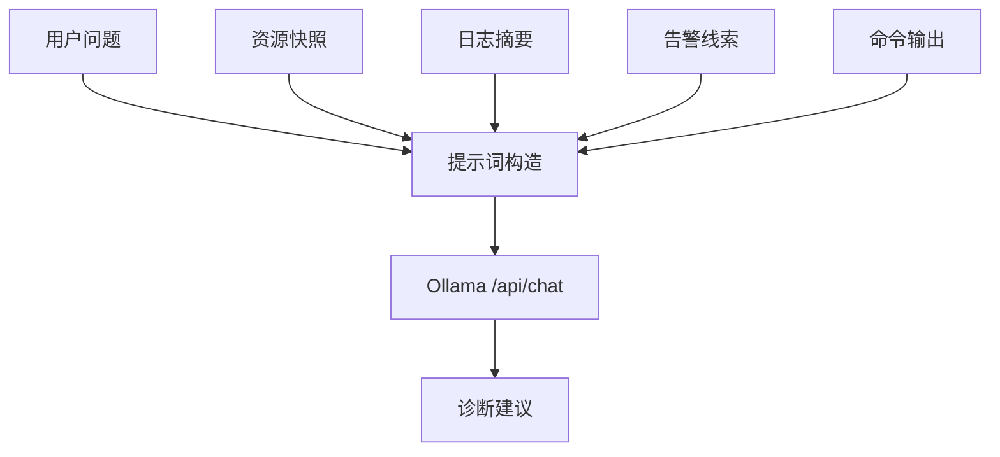
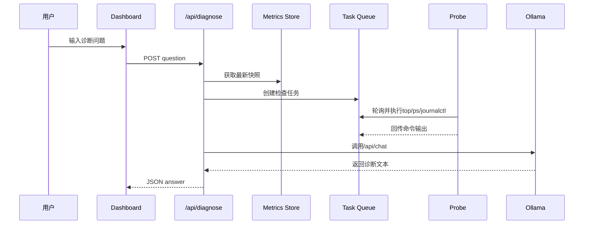
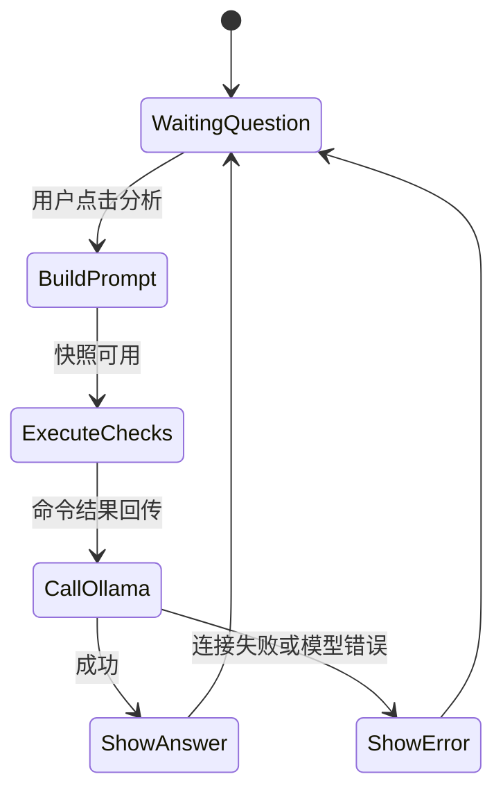

# 基于大模型的运维故障诊断研究

## 摘要

随着大语言模型在代码生成、问答推理和自然语言理解方面能力的提升，将其引入 Linux 运维故障诊断具有现实意义。传统运维诊断依赖管理员经验，需要在资源指标、日志文本和命令输出之间反复切换；而大模型能够把多源信息组织为可读解释，并给出下一步排查命令。本文围绕 Linux服务器智能运维助手中的 AI 诊断模块展开研究。系统使用本地 Ollama 服务，模型为 `gpt-oss:latest`，由 Next.js 服务端 API Route 调用 `/api/chat` 接口，避免浏览器直接访问本机模型服务。当前版本不再停留在“建议管理员执行 top、ps、journalctl”，而是由诊断接口生成只读检查计划，通过 probe 任务通道在 Linux 虚拟机内实际执行，等待命令输出回传后，再把“资源快照、告警、日志、已执行检查结果”交给模型形成结论。本文从运维诊断需求、提示词设计、上下文构造、服务端调用、安全边界和测试效果等方面展开分析。结果表明，本地大模型能够为课程项目提供较自然的故障解释能力，并与 Linux 指标采集、日志分析和真实压力测试形成闭环。

## 关键词

大语言模型；Ollama；Linux运维；故障诊断；提示词工程；本地AI

## Abstract

Large language models are increasingly useful for code generation, question answering and natural language reasoning. Applying them to Linux operation and maintenance diagnosis can reduce the cognitive cost of switching among metrics, logs and commands. This paper focuses on the AI diagnosis module of the Linux intelligent operation and maintenance assistant. The system uses a local Ollama service with the `gpt-oss:latest` model. The Next.js server-side API route calls Ollama's `/api/chat` endpoint, so the browser does not directly access the local model service. The current module generates a whitelist check plan, waits for the probe to execute commands such as top, ps, vmstat and journalctl, and then sends both the resource snapshot and real command outputs to the model. The design shows that a local LLM can provide readable and evidence-based fault diagnosis for a course project.

## Key words

Large language model; Ollama; Linux operations; fault diagnosis; prompt engineering; local AI

## 第一章 绪论

### 1.1 研究背景及意义

Linux 故障诊断往往需要结合多类信息。管理员发现 CPU 占用高后，通常要执行 `top`、`ps`、`journalctl`、`dmesg` 等命令；发现 SSH 登录异常后，还要检查 `/var/log/auth.log`、用户列表、防火墙和密钥配置。对于初学者而言，这种排查流程门槛较高。大语言模型能够把自然语言问题转换为排查步骤，并解释命令意义，因此适合在课程项目中作为“智能运维助手”的核心亮点。

本项目不追求让 AI 直接控制服务器，而是让 AI 做分析和建议。系统把探针采集的资源指标、日志摘要和告警规则作为事实上下文，再由本地 Ollama 模型生成诊断结果。这种设计既体现 AI 能力，又避免模型凭空编造系统状态。

### 1.2 研究现状

当前 AIOps 研究主要关注异常检测、根因分析、日志聚类和自动修复。工业系统通常依赖大量历史数据和复杂模型。近两年，大语言模型被用于日志解释、命令生成和故障报告总结。与云端模型相比，本地 Ollama 的优点是部署简单、数据不出本机、适合教学展示；不足是性能受本机硬件影响，模型能力也取决于本地模型质量。

### 1.3 研究目标与内容

本文目标包括：设计 AI 诊断接口；实现 Next.js 服务端调用 Ollama；构造包含资源指标、日志摘要和命令输出的提示词；规范模型输出结构；实现诊断前的自动检查步骤；测试典型问题如“为什么 CPU 占用高”“SSH 是否有异常”“磁盘空间不足怎么办”。研究内容重点放在模块设计和可解释诊断，而不是复杂模型训练。

### 1.4 论文组织结构

全文分为六章。第一章介绍背景；第二章介绍大模型、Ollama 和提示词技术；第三章进行系统分析；第四章说明 AI 诊断模块实现；第五章测试效果；第六章总结展望。

## 第二章 相关技术概述

### 2.1 大语言模型与运维诊断

大语言模型通过预训练获得语言理解和推理能力。在运维场景中，它可以解释日志含义、生成命令、组织排查流程和总结报告。但模型本身并不知道当前服务器状态，必须由系统提供真实上下文。因此，AI 诊断模块的关键不是简单聊天，而是把“问题 + 数据 + 约束”组合成可靠提示词。

### 2.2 Ollama 本地模型服务

Ollama 提供本地模型运行和 HTTP API。项目使用 `http://127.0.0.1:11434/api/chat`，模型名默认为 `gpt-oss:latest`。本地部署降低了网络依赖，也避免把服务器日志发送到外部平台，适合课程实验和个人电脑演示。

### 2.3 提示词工程

提示词工程用于约束模型角色、输入上下文和输出格式。本项目的系统提示词要求模型扮演 Linux 运维助手，并明确回答必须包含结论、已执行检查、证据、原因推理、解决办法和后续复核命令。如果证据不足，模型应说明缺少哪些命令输出；如果命令已经由 probe 执行，模型必须基于真实输出判断，而不是再次要求用户手动执行同一命令。



## 第三章 系统分析与总体设计

### 3.1 需求分析

AI 诊断模块需要满足以下需求：支持自然语言提问；能够读取最新监控数据；能够引用日志摘要；能够根据问题生成自动检查计划；能够等待 probe 执行只读命令并回传结果；能够返回结论、证据、原因推理和解决办法；调用失败时向前端返回明确错误；模型服务地址和模型名可以通过环境变量配置。

### 3.2 架构设计



本设计把 AI 调用放在服务端，浏览器只访问 Next.js API。这样既符合“不要独立后端”的要求，也能保护 Ollama 地址、模型配置和系统提示词。

### 3.3 诊断边界

AI 本身不直接执行命令，命令执行由服务端根据白名单生成计划，再由 probe 执行。这样既能避免“AI 任意操作服务器”，又能解决早期版本只给出建议、没有实际检查结果的问题。当前允许的命令限定为 `top -b -n 1 | head -20`、`ps aux --sort=-%cpu | head -10`、`uptime`、`vmstat 1 3`、`iostat -dx 1 2`、`journalctl` 近期日志等只读命令，以及课程演示所需的压力测试 start/stop 动作。浏览器不能提交任意 shell 命令。

### 3.4 上下文可信度设计

大语言模型最容易出现的问题是根据常识补全不存在的事实。为了降低该风险，系统在上下文中只放入探针真实上报的数据和已经执行的命令输出，并在提示词中明确要求“不要编造不存在的数据”。例如，当 `top` 显示 CPU idle 为 100% 时，模型必须判断当前没有 CPU 高占用；当磁盘压力按钮创建 4GB 文件后，模型可以引用 `df -h /var/tmp` 的结果说明磁盘使用率上升；当日志检查没有 warning 时，模型不能声称发现系统错误。对于证据不足的场景，模型应说明仍缺少哪些信息。这种设计将 AI 定位为基于证据的辅助分析者，而不是最终裁决者。

## 第四章 系统核心模块与实现

### 4.1 服务端诊断接口

`/api/diagnose` 接收 JSON 请求 `{ "question": "为什么CPU占用高？" }`。接口校验问题是否为空，随后读取 `getSnapshot()` 中的最新监控数据。若存在真实 probe 数据，接口先调用 `buildDiagnosticPlan()` 生成检查计划，再通过 `enqueueCommandTasks()` 写入任务队列，并等待 `waitForCommandResults()` 返回结果。最后才调用 `diagnose()` 函数访问 Ollama。

### 4.2 上下文构造

上下文不再简单传入完整大 JSON，而是由服务端压缩为诊断摘要，包含用户问题、主机名、最近上报时间、CPU 当前值和历史统计、Load Average、内存和磁盘占用、规则告警、进程样本说明、日志关键线索以及自动命令输出。这样既减少无关日志干扰，也能让模型聚焦证据。

### 4.3 输出约束

系统提示词要求模型输出六类内容：结论、已执行检查、证据、原因推理、解决办法和后续复核命令。若上下文中已经包含 `top`、`ps`、`vmstat`、`journalctl` 输出，模型必须基于这些输出判断，而不能再把它们当作未执行建议。例如对于 CPU 高负载，系统会先自动执行：

```bash
top
ps aux --sort=-%cpu | head
journalctl -p warning --since "30 minutes ago"
```

这些命令符合 Linux 运维排查习惯，也方便学生展示系统能力。模型最终报告中会说明这些命令已经执行，并引用关键输出，如 `%Cpu(s)`、`%CPU` 排序、`load average` 或 warning 日志。

### 4.4 错误处理

如果 Ollama 未启动或模型不存在，服务端返回 502，并把错误信息显示在页面中。这样展示时能快速判断是 Web 问题还是模型服务问题。



## 第五章 系统测试与效果分析

### 5.1 连接测试

启动 Ollama 后，运行 `ollama list` 确认存在 `gpt-oss:latest`。启动 Next.js 应用，在页面输入问题并点击分析，若返回诊断文本，说明 API 链路正常。测试中还使用 Ollama CLI 直接调用模型，确认本地模型可用。若返回连接失败，通常是 Ollama 未启动、地址不通或模型名错误。

### 5.2 典型问题测试

问题一：“为什么CPU占用高？”系统会自动执行 `top`、`ps`、`uptime` 和 `vmstat`，模型根据输出判断当前是否真的高负载。问题二：“SSH是否有异常？”系统会自动执行 SSH 近期日志检查，模型关注 Failed password、Invalid user、Accepted publickey 等内容。问题三：“磁盘空间是否危险？”系统会结合 probe 的磁盘使用率和必要的 I/O 检查输出，给出是否清理文件、删除压力文件或扩容的建议。

### 5.3 效果分析

AI 诊断模块的价值体现在四个方面。第一，把离散指标组织为自然语言结论；第二，自动完成中间检查步骤，减少学生手动切换终端；第三，把日志证据和资源状态关联起来，避免只看单一指标；第四，把 CPU、内存、磁盘压力测试后的真实结果转化为可读报告。局限在于模型回答仍可能不稳定，因此系统提示词中要求“不编造不存在的数据”，并通过规则兜底保证返回内容至少包含证据和后续复核命令。

### 5.4 风险控制测试

在测试中，可以故意提出超出数据范围的问题，例如“数据库为什么崩溃了”。如果当前系统没有数据库进程、数据库日志或端口信息，理想回答应说明缺少证据，并建议补充 `systemctl status`、`journalctl -u`、端口监听和应用日志。该测试用于检验提示词是否能约束模型。另一个测试是关闭 Ollama 服务后点击分析，页面应展示连接错误，而不是卡死或返回空白。通过这类异常测试，可以证明 AI 模块不仅能在正常情况下回答问题，也能在依赖不可用时保持可解释的失败状态。

## 第六章 总结与展望

本文设计并实现了基于 Ollama 的运维故障诊断模块。该模块通过 Next.js 服务端接口调用本地大模型，把资源快照、日志摘要、告警线索、自动命令输出和用户问题组合为提示词，生成可读诊断建议。新版系统已经实现命令输出回传和风险命令白名单，满足课程项目“Linux + AI”的主题要求。后续可加入多轮对话、诊断报告保存、RAG 运维知识库、任务权限分级和更细粒度的进程 CPU 采集，使系统从问答助手进一步发展为交互式运维平台。

## 参考文献

[1] OpenAI. Large Language Models and Prompting Practices.  
[2] Ollama Documentation: REST API and Chat endpoint.  
[3] Microsoft. AIOps and incident management practices.  
[4] Brendan Gregg. Systems Performance: Enterprise and the Cloud.  
[5] Google SRE Book: Monitoring Distributed Systems.

## 附录：核心代码

```ts
const response = await fetch(`${OLLAMA_URL}/api/chat`, {
  method: "POST",
  headers: { "content-type": "application/json" },
  body: JSON.stringify({
    model: OLLAMA_MODEL,
    stream: false,
    messages: [
      { role: "system", content: systemPrompt },
      { role: "user", content: userPrompt }
    ]
  })
});
```

该代码是 AI 诊断模块的核心，体现了 Next.js 服务端调用本地 Ollama 模型并传递结构化上下文的过程。

```ts
const plan = buildDiagnosticPlan(question, snapshot);
const tasks = enqueueCommandTasks(snapshot.latest.hostname, plan);
const commandResults = await waitForCommandResults(tasks.map((task) => task.id));
const answer = await diagnose(question, refreshedSnapshot, commandResults);
```

该代码体现了新版 AI 诊断模块的关键变化：模型不是凭空建议命令，而是在 probe 完成自动检查后，基于真实命令输出生成结论。
