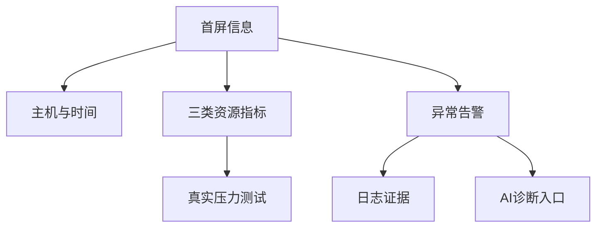
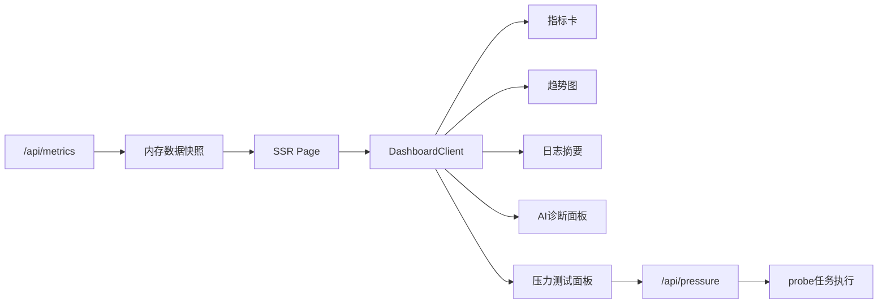
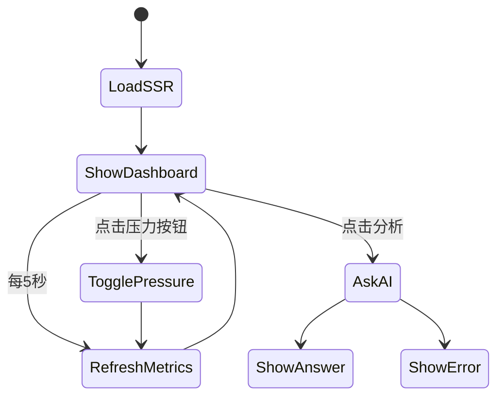

# 运维管理平台可视化设计

## 摘要

运维管理平台的可视化设计直接影响管理员发现问题、理解状态和执行排查的效率。本文围绕 Linux服务器智能运维助手中的 Web 展示模块展开研究，设计并实现了基于 Next.js 的前后端一体 Dashboard。系统使用 App Router 构建 SSR 页面，通过 API Routes 接收 C++ 探针上报的数据，并在客户端定时刷新资源状态。页面包含主机状态栏、CPU/内存/磁盘指标卡、资源趋势折线图、告警线索、日志摘要、真实压力测试面板和 AI 诊断输入区。当前版本明确取消前端模拟指标，页面在无 probe 数据时显示等待状态；CPU、内存、磁盘压力按钮会通过 API 下发任务，由 Linux 虚拟机中的 probe 实际制造资源占用。与单纯命令行输出相比，可视化平台能够把多源运维信息组织在同一界面，降低初学者理解成本。本文从需求分析、信息架构、界面布局、数据刷新、图表设计、响应式适配和测试效果等方面说明实现过程。该模块不使用独立后端，符合课程项目对 React、Next.js SSR/SSG 和本地 Ollama 接入的要求。

## 关键词

运维可视化；Next.js；React；Dashboard；SSR；智能运维

## Abstract

Visualization design directly affects how efficiently administrators discover problems, understand system status and perform troubleshooting. This paper focuses on the web visualization module of the Linux intelligent operation and maintenance assistant. A Next.js dashboard is implemented with the App Router. API Routes receive data from the C++ probe, while the client periodically refreshes resource status. The page includes host status, CPU/memory/disk cards, trend charts, alert clues, log summaries, real pressure-test controls and an AI diagnosis panel with Markdown rendering. Compared with command-line output, the dashboard organizes multiple operation signals in one interface and reduces the learning cost for beginners. The module does not use an independent backend and satisfies the course requirements for React, Next.js SSR/SSG-style architecture and local Ollama integration.

## Key words

Operations visualization; Next.js; React; dashboard; SSR; intelligent operations

## 第一章 绪论

### 1.1 研究背景及意义

Linux 运维信息通常分散在不同命令和文件中。管理员需要使用 `top` 查看 CPU，使用 `free` 查看内存，使用 `df` 查看磁盘，使用 `journalctl` 或日志文件查看异常事件。这种方式对熟练管理员有效，但对课程学习和演示不够直观。可视化平台能够把关键指标集中展示，让用户先形成整体判断，再进入命令行排查。

本项目的 Web 展示模块承担三项职责：展示系统当前状态，呈现日志与告警线索，提供 AI 诊断入口。它不是营销页面，而是面向运维工作流的 Dashboard，因此设计上强调信息密度、清晰层级和快速扫描。

### 1.2 研究现状

Grafana、Kibana、Zabbix Web 等平台是成熟的运维可视化工具，具备丰富图表和告警能力。但这些工具功能庞大，课程项目中难以完整复现。React 和 Next.js 提供了构建现代 Web 应用的基础能力，Next.js API Routes 又能实现轻量服务端接口，适合构建“前后端一体”的课程作品。

### 1.3 研究目标与内容

本文目标包括：设计运维 Dashboard 信息架构；实现 SSR 首屏数据加载；实现指标卡和趋势图；实现日志摘要和告警展示；实现 AI 诊断交互；实现 CPU、内存、磁盘真实压力测试按钮；实现 Markdown 诊断报告渲染和“分析中”加载状态；完成移动端响应式适配。研究内容重点体现平台可视化和交互设计，而不独立拆分后端服务。

### 1.4 论文组织结构

全文包括六章。第一章介绍背景；第二章介绍 Next.js、React 和可视化技术；第三章说明需求与总体设计；第四章分析核心实现；第五章给出测试效果；第六章总结展望。

## 第二章 相关技术概述

### 2.1 React 组件化思想

React 通过组件组织 UI。指标卡、图表、日志面板和 AI 面板都可以拆分为组件，使代码结构清晰。本项目中 `DashboardClient` 负责客户端刷新和交互，`StatCard` 负责复用指标卡样式。

### 2.2 Next.js App Router

Next.js App Router 支持服务端组件、动态路由和 API Routes。项目的 `app/page.tsx` 是服务端页面，进入页面时获取最新快照，实现 SSR；`app/api/metrics/route.ts` 接收探针数据；`app/api/diagnose/route.ts` 调用 Ollama。这样既有 React 前端，又不需要单独写 Express 或 Flask 后端。

### 2.3 Dashboard 可视化原则

运维 Dashboard 应优先展示状态、趋势和异常，而不是堆砌说明文字。本文页面采用三张指标卡表达 CPU、内存、磁盘当前状态，用折线图表达趋势，用告警列表表达风险，用日志面板呈现证据，用压力测试面板制造真实异常，用 AI 面板完成诊断闭环。



## 第三章 系统分析与总体设计

### 3.1 需求分析

Web 展示模块功能需求包括：接收探针上报；显示最新资源指标；显示最近趋势；显示日志摘要；支持用户输入问题并获取 AI 诊断；支持 CPU、内存、磁盘真实压力启动与停止；页面自动刷新。非功能需求包括：界面清晰、响应式适配、无需独立后端、服务端保护 Ollama 调用、代码便于课程说明，并且不能用前端假数据冒充 Linux 指标。

### 3.2 信息架构设计



页面顶部展示项目名称和刷新按钮，紧接着是主机状态行，之后是三张资源卡。下方两列布局用于展示趋势、告警、压力测试、日志、进程 TopN 和 AI。移动端则改为单列，保证文字不挤压。

### 3.3 数据刷新设计

首屏由服务端获取 `getSnapshot()`。如果没有真实 probe 数据，页面不会填充演示数据，而是显示“等待真实探针”的状态和连接说明。客户端通过 `setInterval` 每 5 秒请求 `/api/metrics`，使页面能够看到探针持续上报的变化。该方式实现简单，适合单机课程项目，也避免了模拟数据与真实数据混淆。

### 3.4 视觉层级与交互设计

Dashboard 的第一层信息是“这台机器是否正常”，因此主机名、上报时间和三张资源卡放在页面上方。第二层信息是“哪里可能异常”，因此趋势图和告警线索紧随其后。第三层信息是“证据和解释”，对应日志摘要和 AI 诊断面板。这样的层级符合运维排查路径：先看状态，再看异常，再看证据，最后形成处置建议。

在交互设计上，页面保留必要控件：刷新按钮、压力测试按钮、问题输入框和分析按钮。刷新按钮使用图标降低视觉负担；分析按钮在等待期间显示旋转图标，避免用户误以为页面卡死；压力测试按钮分为 CPU、内存、磁盘三类，启动后可切换为停止状态。页面没有设置复杂菜单，因为当前项目是单主机课程系统，过多导航会削弱核心功能展示。

## 第四章 系统核心模块与实现

### 4.1 指标卡设计

指标卡包含图标、名称、百分比和说明。CPU 显示使用率，内存显示已用/总量，磁盘显示可用空间。不同风险状态使用不同色彩，但整体保持克制，避免影响阅读。

### 4.2 趋势图实现

趋势图使用 SVG `polyline` 绘制最近 30 次采样数据。相比引入大型图表库，手写 SVG 更轻量，也能满足课程展示。CPU、内存和磁盘用不同颜色区分，并配有图例。

### 4.3 日志与告警面板

日志面板使用深色 `pre` 区域展示原始摘要，便于保留日志格式。告警面板则把规则判断转换为短句，如 CPU 过高、内存过高、磁盘过高或日志存在异常关键词。这样用户既能看到机器判断，也能查看原始证据。

### 4.4 AI 诊断交互

AI 面板包含输入框和分析按钮。用户点击后，客户端向 `/api/diagnose` 发送问题。按钮在等待期间禁用并显示旋转图标，避免重复提交。返回后结果使用轻量 Markdown 渲染器展示，支持标题、列表、行内代码、代码块、引用和分隔线，避免 `**结论**`、```bash``` 等标记原样显示，提升报告可读性。

### 4.5 真实压力测试面板

压力测试面板提供三个按钮：启动 CPU 压力、启动内存压力、启动磁盘压力。用户点击后，前端调用 `/api/pressure`，服务端把任务写入队列，probe 轮询并在虚拟机内执行。CPU 压力通过 busy loop 让 CPU 升高；内存压力通过 Python 分配约 2.1GB 内存；磁盘压力通过在 `/var/tmp` 创建 4GB 文件占用根分区空间。每个按钮都支持停止，避免测试结束后持续占用资源。

### 4.6 前后端一体实现特点

本项目没有创建独立后端目录，而是把服务端能力放入 Next.js API Routes。`/api/metrics` 负责接收探针上报和返回快照，`/api/logs` 返回日志摘要，`/api/diagnose` 调用 Ollama，`/api/probe/tasks/next` 和 `/api/probe/tasks/result` 负责 probe 任务交互，`/api/pressure` 负责压力测试控制。这样前端页面、服务端接口和模型调用都在同一个 Next.js 项目内，部署时只需要运行一个 Web 应用。对于期末作业而言，这种结构更容易讲清楚，也能体现 SSR、客户端刷新和服务端 API 的结合。



## 第五章 系统测试与效果分析

### 5.1 页面加载测试

启动 Web 后访问 `http://127.0.0.1:3001`，若没有真实探针数据，页面显示等待状态和 probe 配置提示，不再创建演示数据。这样能够避免学生误把前端假数据当作 Linux 真实指标。启动虚拟机和 probe 后，页面状态变为“真实探针在线”。

### 5.2 探针接入测试

探针向 `/api/metrics` POST 数据后，页面的主机名、时间、资源百分比和日志摘要都会更新。刷新按钮和自动刷新均可获取最新快照，说明前后端一体数据链路有效。

### 5.3 压力测试交互测试

点击“启动CPU压力”后，虚拟机内启动 busy loop，页面 CPU 指标可达到 100%，趋势图出现明显上升；点击“启动内存压力”后，内存使用率上升到约 66%，进程 TopN 中出现 Python 进程；点击“启动磁盘压力”后，`/var/tmp` 中创建 4GB 文件，根分区使用率从约 16% 上升到约 37%。停止按钮均能清理对应压力源，验证页面不是模拟指标，而是控制真实 Linux 资源。

### 5.4 响应式测试

桌面端采用两列信息布局，便于同时观察图表和日志；移动端在 820px 以下变为单列，按钮和输入框上下排列，避免文本溢出。该设计保证不同屏幕下都能完成基本操作。

### 5.5 可用性效果分析

从使用流程看，用户打开页面后不需要阅读说明文字即可理解当前系统状态。指标卡用百分比表达资源占用，图表用趋势表达变化，日志区保留原始文本，压力测试区可以制造真实异常，AI 区支持直接提问。对于课堂演示，可以先启动 Ubuntu 虚拟机中的探针观察真实数据，再点击 CPU、内存或磁盘压力按钮制造变化，最后输入问题触发 Ollama 分析。整个流程能够连续展示 Linux 采集、Web 接收、可视化、真实压测和 AI 诊断五个环节。

该可视化模块仍有局限。当前数据存储在内存中，重启 Web 后历史会丢失；趋势图只保留最近 30 次采样，不能进行长期分析；告警阈值固定写在代码中，不能由用户配置。这些限制是为了降低课程项目复杂度，但也为后续扩展留下了方向。

## 第六章 总结与展望

本文完成了运维管理平台可视化模块的设计与实现。系统使用 Next.js 构建 SSR 页面和 API Routes，不需要独立后端；使用 React 组件管理界面；使用 SVG 绘制资源趋势；使用服务端接口调用 Ollama 完成 AI 诊断；使用压力测试面板控制虚拟机真实资源占用。该模块让资源、日志、告警、压力测试和 AI 建议集中在同一页面，提升了课程项目展示效果。后续可加入数据库持久化、多主机列表、用户登录、告警配置、图表缩放、诊断历史记录和任务审计，使平台更加完整。

## 参考文献

[1] Next.js Documentation: App Router and Route Handlers.  
[2] React Documentation: Components and Hooks.  
[3] Grafana Documentation: Dashboard design practices.  
[4] Nielsen Norman Group. Dashboard UX guidelines.  
[5] Google SRE Book: Practical alerting and observability.

## 附录：核心代码

```tsx
useEffect(() => {
  const timer = window.setInterval(refresh, 5000);
  return () => window.clearInterval(timer);
}, []);

async function refresh() {
  const response = await fetch("/api/metrics", { cache: "no-store" });
  setSnapshot(await response.json());
}
```

该代码体现了 Web 展示模块的核心交互：页面首屏由 SSR 提供数据，客户端再按周期刷新最新监控快照。

```tsx
async function togglePressure(target: PressureTarget) {
  const action = pressureRunning[target] ? "stop" : "start";
  await fetch("/api/pressure", {
    method: "POST",
    headers: { "content-type": "application/json" },
    body: JSON.stringify({ target, action })
  });
}
```

该代码体现了新版 Web 模块的交互亮点：前端按钮并不修改本地假数据，而是通过 API 控制 probe 在 Linux 虚拟机内制造或停止真实资源压力。
